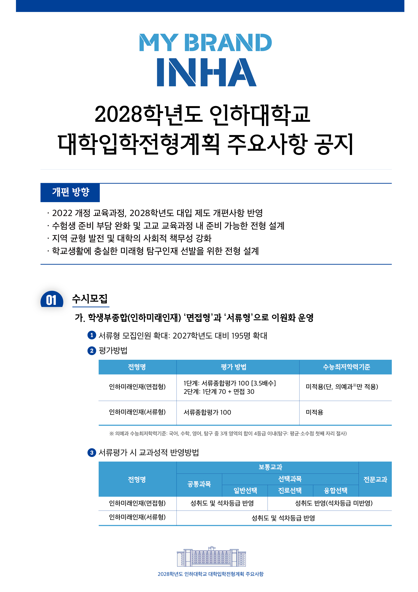
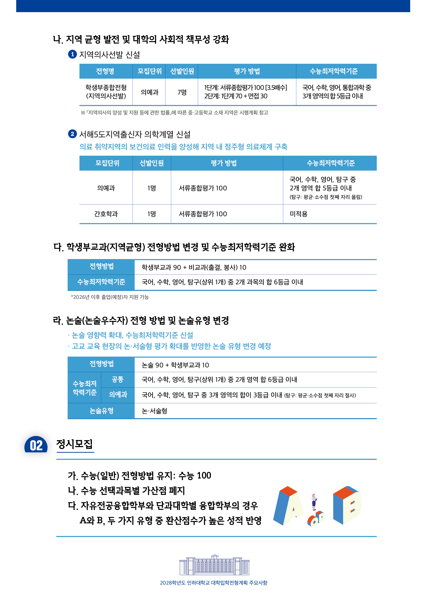

# 인하대, 2028학년도 대학입학전형계획 주요사항 공식 시한 전 선공개

인하대가 2028학년도 전형계획 주요사항을
공식 시한(4/30) 전에 선공개했습니다.

👉 핵심 변화 포인트  
✔ 의예과 '지역의사선발' 학종 7명 신설  
✔ 학종 인하미래인재 서류형 195명 확대  
✔ 논술 반영 비율 90%로 상향, 출제 유형도 변경  
✔ 정시는 수능 100% 유지, 선택과목 가산점 폐지

📌 특히 학종 서류형을 대폭 늘린 점이 눈에 띕니다.  
면접 부담을 줄이고 학생부 기반 평가를 강화하겠다는 방향으로,
학교생활 충실도를 중시하는 흐름이 더욱 뚜렷해졌습니다.

2028 대입개편 첫 적용 대상인 현 고2 학생들에게는
지금부터의 교과 이수 설계와 학생부 관리가
그 어느 때보다 결정적인 시기입니다.

✅ 자세한 내용은 링크로 확인해 주세요.  
👉 https://admission.inha.ac.kr/cms/FR_BBS_CON/BoardView.do?pageNo=1&pagePerCnt=15&MENU_ID=240&CONTENTS_NO=1&SITE_NO=2&BOARD_SEQ=1&BBS_SEQ=1297

---

