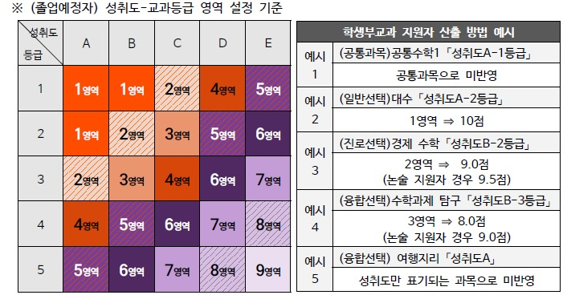

# 동국대, ‘2028학년도 대입전형 개편안’ 발표… “고교 교육에 대한 굳건한 신뢰로 공교육 내실화 이끈다”

동국대가 2028학년도 대입에서
정시 비율을 30%로 축소하고
수시는 확대하기로 공식화했습니다.

👉 정시 전 모집군에 '수능 80% + 학생부 정성평가 20%' 도입  
👉 대표 학종 'Do Dream' 면접 비중 30% → 40%로 확대  
👉 교과전형에 '2차원 매트릭스(성취도+상대등급)' 최초 도입

📌 이번 개편은 교육부 '고교교육 기여대학 지원사업'의
자율공모사업 선정에 따른 후속 조치로,  
정시 40% 규제에서 벗어난 서울대·한양대·동국대가
모두 정시 축소 흐름에 합류한 모습입니다.

✅ 자세한 내용은 링크로 확인해 주세요.  
👉 https://www.dongguk.edu/article/news/detail/26764509

---

