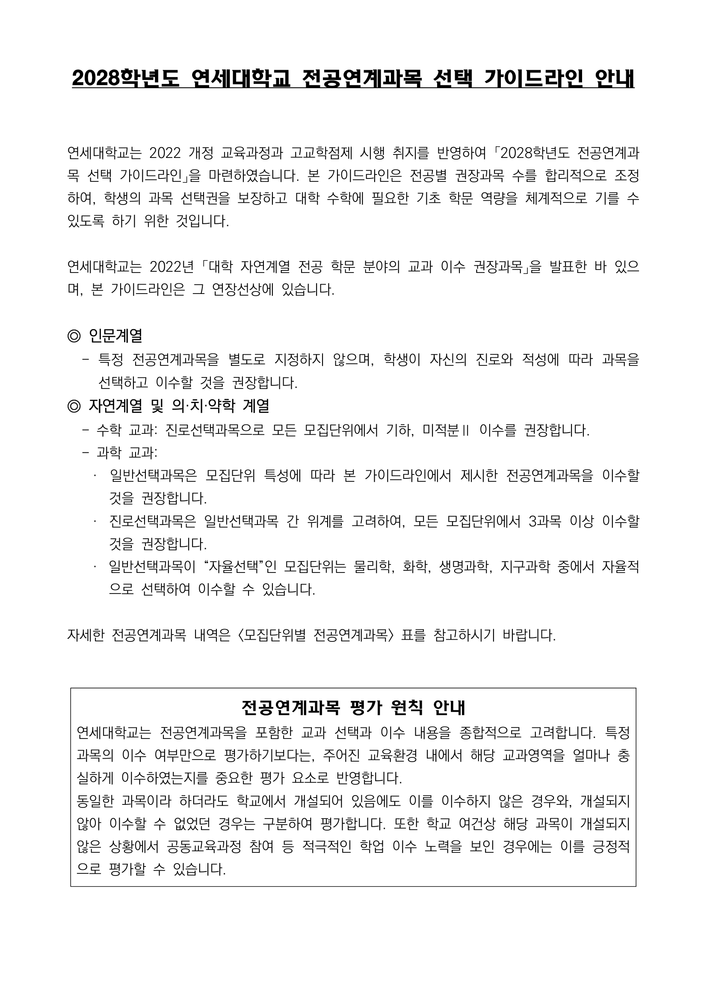
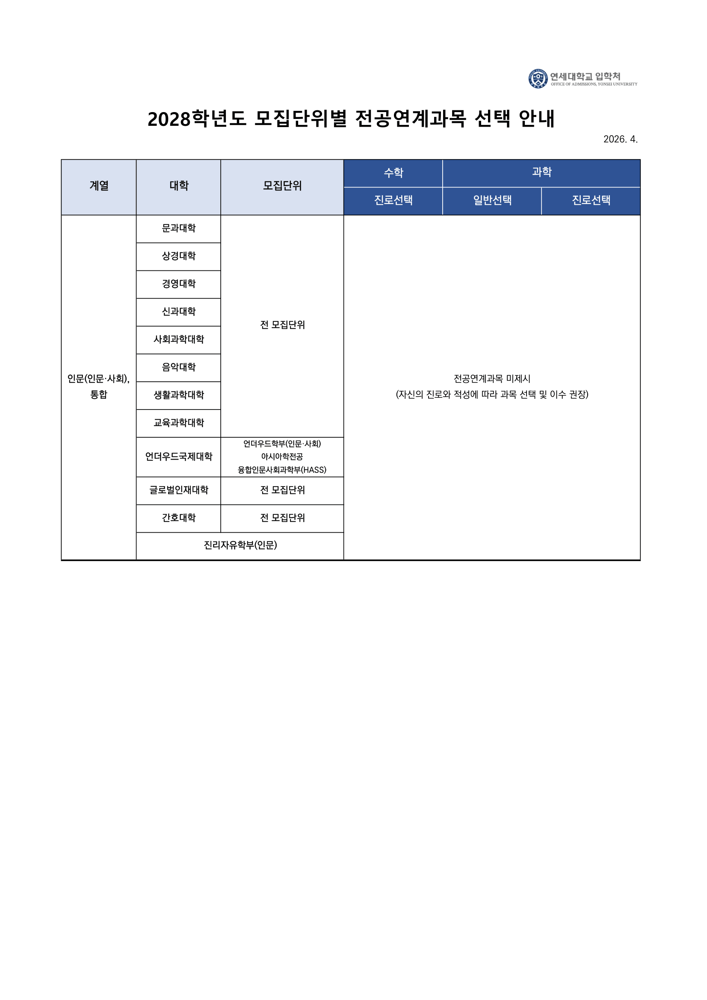
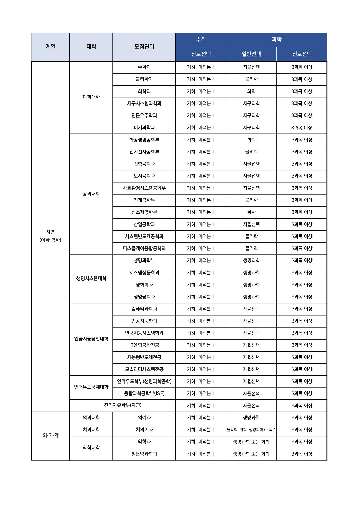

# 2028학년도 연세대학교 전공연계과목 선택 가이드라인 안내

연세대가 2028학년도 모집단위별
전공연계과목 가이드라인을 공개했습니다.

👉 인문·사회계열은 '자율선택'  
👉 자연·의치약계열은 수학 '기하 + 미적분Ⅱ',  
과학 진로선택 '3과목 이상' 권장

📌 특히 눈여겨볼 지점은  
✔ 컴퓨터과학·인공지능·IT융합·지능형반도체 등은  
'자율선택'으로 열어두되, 이수 내용을 종합 평가  
✔ 서울대, 경희대, 건대, 동대, 숙대에 이어  
상위권 대학 권장과목 공개 흐름 확산  
✔ 단순 '이수 여부'가 아닌, 학교 개설 여건과 학생의  
학업 노력까지 정성적으로 함께 평가

이번 발표의 핵심은 '권장과목 리스트'가 아니라,
과목 선택의 맥락과 깊이를 본다는 메시지입니다.

특히 AI, 반도체, IT 계열처럼 '자율선택'으로 풀어둔
모집단위일수록 오히려 학생부에 담긴 학업 서사가
당락을 가르게 됩니다. 

같은 과목을 들었어도
"왜 이 과목을 선택했는가, 무엇을 배웠는가"가
정성평가의 출발점이 되는 구조입니다.

고1·고2 학생이라면 지금부터 진로 방향에 맞는
과목 선택과 세특 기록을 일관되게 쌓아가는 것이
가장 확실한 대비입니다.

✅ 자세한 내용은 링크로 확인해 주세요.
👉 https://www2.yonsei.ac.kr/entrance/plan/2028_guide.pdf

---

