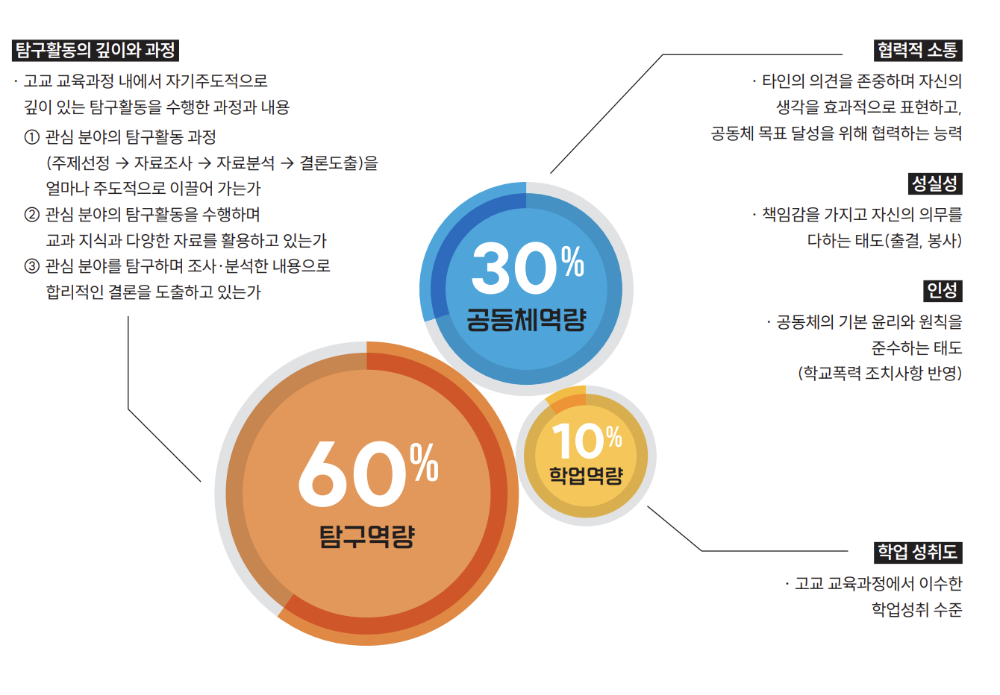
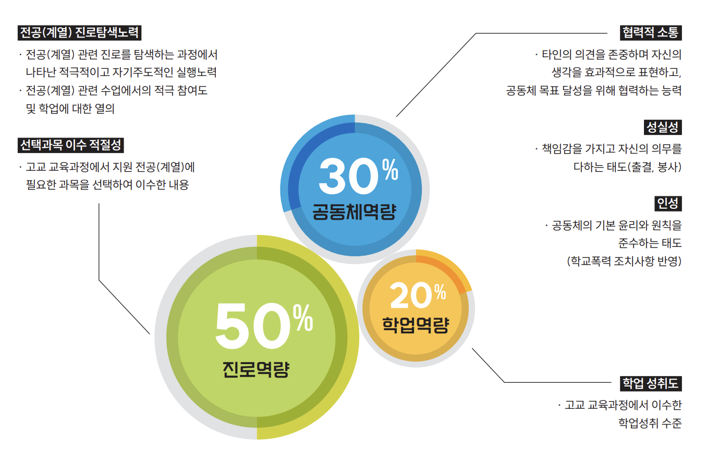

# 숭실대가 직접 밑줄 그어준 합격 학생부, 무엇이 달랐을까

2027학년도 숭실대 학종에서는
'활동 개수'가 아니라 '탐구의 깊이'가 합격을 가른다는
구체적인 평가 방향이 공개됐습니다.

👉 학종 SSU미래인재전형이  
'서류형'과 '면접형'으로 이원화  
서류형은 탐구역량 60%, 면접형은 진로역량 50%

📌 숭실대 가이드북은
실제 합격생 학생부에 직접 밑줄을 그어  
'우수 평가 포인트'를 공개한 점이 눈에 띕니다.

특히 주목할 점은  
✔ 단순 스펙이 아닌 "왜 했고, 어떻게 확장했는가" 평가  
✔ 교과 수업 속 궁금증 → 심화 탐구 → 후속 활동 확장 구조 선호  
✔ 면접 질문도 학생부 기반 '검증형'으로 구성

결국 자신의 관심 분야에서  
'하나의 질문'을 끝까지 파고드는 경험이  
학종 합격의 핵심 변수가 될 전망입니다.

[2027학년도 숭실대학교 학종가이드북.pdf](file/2027학년도%20숭실대학교%20학종가이드북.pdf)

---

