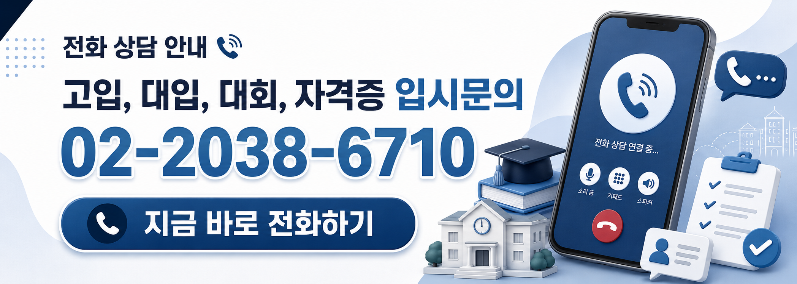

새로운 시작의 계절, 신학기가 밝았습니다.

새로운 학년, 새로운 목표와 함께 설레는 마음으로 출발하셨으리라 생각합니다.

신학기는 한 해의 방향을 결정짓는 매우 중요한 시기입니다. 특히 입시를 준비하는 학생들에게는 학습 습관을 바로잡고 전략을 점검하는 결정적인 출발점이 됩니다.

다가오는 3월 24일 (화) 3월 모의고사는 현재 자신의 위치를 객관적으로 점검할 수 있는 첫 시험입니다. 반드시 일정과 준비 사항을 꼼꼼히 확인하여 최상의 컨디션으로 응시하시기 바랍니다.

## 📌 신학기에 꼭 챙겨야 할 사항
1. 3월 24일 3월 모의고사 일정 확인 및 대비
    - 실전 시간 관리 연습
    - 오답 정리 계획 수립
    - 모의고사 성적 기반 대학 리스트업 하기

2. 학습 루틴 재정비
    - 고정된 공부 시간 확보
    - 주간·월간 학습 계획 수립
    - 취약 과목 보완 전략 설정

3. 입시 전략 점검
    - 희망 대학 및 전형 변화 확인
    - 학생부 관리 방향 설정
    - 비교과 활동 계획 수립

4. 상담 및 피드백 적극 활용
    - 입시 컨설팅 상담 예약
    - 모의고사 이후 성적 기반 전략 세우기

신학기의 작은 차이가 큰 결과의 차이를 만듭니다.

메가입시컨설팅은 여러분의 목표 달성을 위해 항상 함께하겠습니다.

감사합니다.

---

