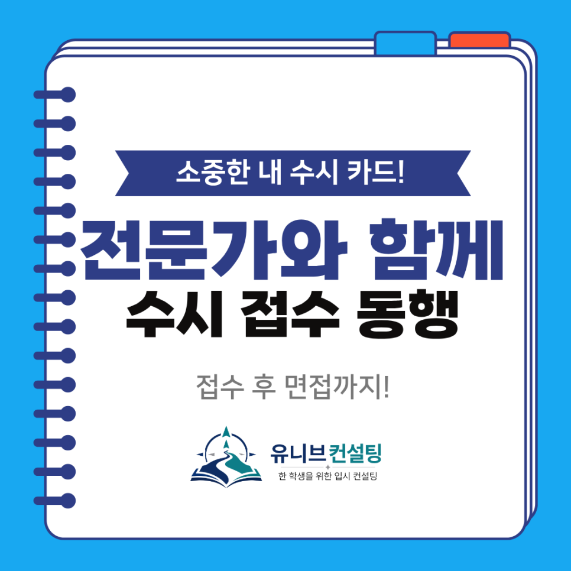
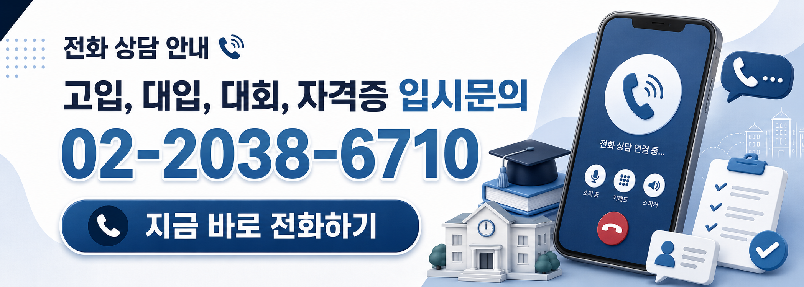

안녕하세요, 유니브 대입 입시센터입니다 👋
​

드디어 2027학년도 수시 원서 접수가 코앞으로 다가왔습니다.  
라인업은 정했는데, 막상 "직접 넣는 순간"이 되면  
손이 떨리고 머릿속이 하얘지는 분들 많으시죠. 😢
​

전형 코드 하나, 군 배치 하나만 잘못 눌러도  
6장 중 한 장이 그대로 날아갈 수 있으니까요.
​

그래서 유니브 대입 입시센터가 접수 기간 5일 동안  
학생 곁에서 실제 원서 접수를 함께 진행해 드립니다.  

## 😰 원서 '접수'가 왜 이렇게 떨릴까요?
​
✔ 진학어플라이·유웨이 사이트가 처음이라 헷갈려요  
✔ 전형·학과·군 코드를 잘못 고를까 봐 무서워요  
✔ 첨부 서류나 입력값이 빠졌는지 확인이 안 돼요  
✔ 마감 시간에 몰려 접수하다 실수할까 걱정돼요  
✔ 결제·최종 제출까지 제대로 됐는지 불안해요  
​

라인업을 잘 짜는 것만큼 중요한 게, 그 6장을 실수 없이 정확히 넣는 일이에요.

​
접수는 한 번 제출하면 되돌리기 어렵거든요. 🔍  

## 📝 9월 수시 접수, 이렇게 함께합니다
​
확정한 원서를 학생 혼자 넣게 두지 않습니다.  
접수 시작부터 마감까지, 유니브 대입 입시센터가  
실제 원서 접수 과정을 처음부터 끝까지 함께합니다.

​
✔ 진행 기간 : 9월 7일 ~ 9월 11일 (수시 접수 기간)  
✔ 진행 방식 : 대면 / 비대면 모두 가능  
✔ 참가 비용 : 단돈 1만 원  
✔ 대상 : 수시 접수를 앞둔 고3·재수생 및 학부모  
​

접수 기간 내내 곁에서 함께 넣어드리는데,  
비용은 커피 두 잔 값. 부담 없이 시작하실 수 있어요. ☕  

## 🖥️ 접수 5일, 이렇게 동행합니다
​
### 1️⃣ 접수 사이트 함께 세팅
진학어플라이·유웨이 회원가입부터 함께 진행합니다
​
### 2️⃣ 대학·학과·전형·군 입력 더블 체크
확정한 6장을 코드 하나까지 정확히 입력·검토합니다
​
### 3️⃣ 서류·입력값 최종 점검
누락된 항목이나 오입력이 없는지 함께 확인합니다
​
### 4️⃣ 결제·최종 제출·마감 관리
제출 완료까지 확인하고 마감 시간을 놓치지 않게 챙깁니다

​
"넣긴 넣었는데 맞게 넣었나?" 하는 불안 없이,  
확정한 6장을 그대로 정확히 접수하도록 도와드립니다. 🎯

## 🧭 6장 라인업부터 고민이라면?
​
"어디에 넣을지"부터 아직 못 정하셨다면,  
접수 동행에 앞서 수시 라인 컨설팅이 먼저예요.

​
· 누적 합격선 데이터 기반 6장 라인업 설계  
· 학종·교과·논술 전형별 유불리 분석  
· 안전·적정·상향 후보군 시뮬레이션  
👉 https://univconsulting.kr/univ/early

그리고 수시 라인 컨설팅을 진행하시면,  
9월 접수 동행(1만 원)은 무료로 함께 제공해 드립니다. 🎁
​

라인업 설계부터 실제 접수까지, 끊김 없이 이어드려요.

## 🎁 면접 컨설팅도 반값으로!

수시는 원서를 넣는 순간 끝이 아니에요.  
1단계 합격 이후, 진짜 승부는 면접에서 갈립니다.  
​

그래서 이번 접수 동행 프로그램에 참여하시면,  
유니브 대입 면접 컨설팅을 특별가로 준비해 드립니다.
​

✔ 정가 80만 원 → 40만 원 (50% 할인)  

· 학생부 기반 예상 질문 도출  
· 2회 모의면접 + 영상 피드백  
· 대학별 출제 경향 맞춤 대응
​

원서를 넣는 순간부터 면접까지, 끊김 없이 이어드립니다.  
👉 https://univconsulting.kr/univ/interview

## 👨‍🏫 검증된 컨설턴트진이 직접 함께합니다

✔ 김류빈 대표원장 — 메가스터디SW입시센터 대표 컨설턴트 출신, 영재학교·고려대 컴퓨터학과, 학생부종합·특기자 컨설팅
​

✔ 심훈 컨설턴트 — 메가스터디SW입시센터 대표 강사 출신, 전공 내신 전략·자소서 관리·면접 컨설팅

​
✔ 강은솔 컨설턴트 — 메가스터디SW입시센터 대표 강사 출신, AI·게임제작·학생부종합 컨설팅

​
✔ 진은재 컨설턴트 — 메가스터디SW입시센터 특기자반 강사 출신, 영재학교·KAIST 전산학부, 특기자·논문 컨설팅

​
그 외에도 각 분야의 전문 컨설턴트들이 함께합니다.  
​

최근 3년간 KAIST, 서울대, 고려대, 연세대, 중앙대 등  
주요 대학 진학을 지도해온 탄탄한 실적도 갖추고 있어요. 🏆

## 📅 접수 기간 5일, 지금 신청하세요!

수시 접수 기간(9/7~9/11)은 순식간에 지나갑니다.  
일정이 빠르게 마감되니 가급적 미리 신청해 주세요. 😊
​

단돈 1만 원으로 6장을 실수 없이 넣고,  
면접 컨설팅까지 반값으로 이어가는 기회예요.
​

수시는 결국 시간 싸움입니다.  
마지막 접수, 유니브 대입 입시센터와 함께 끝내세요! 🎯

​
📞 전화 문의 : 02-2038-6710    
📩 카카오톡 : https://pf.kakao.com/_xbfEKX/chat

---

