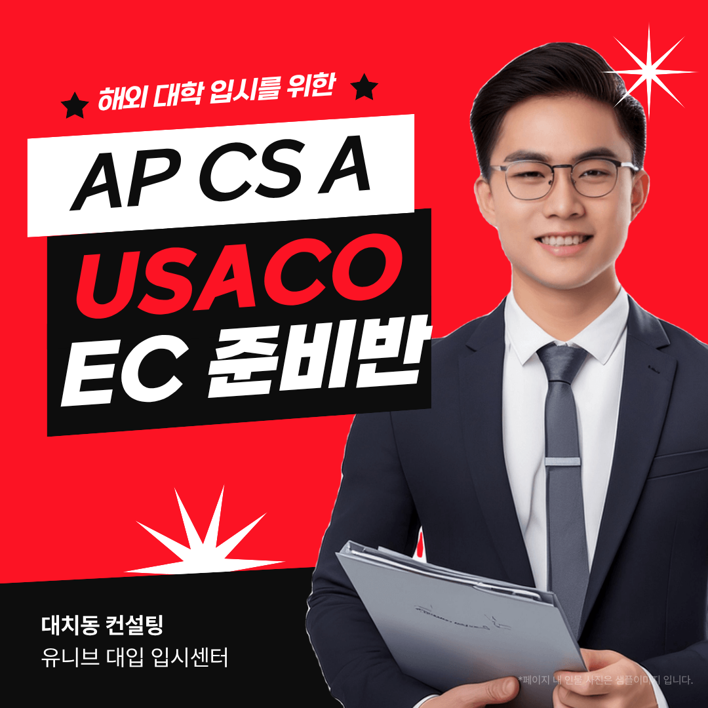

안녕하세요, 유니브 대입 입시센터입니다 👋
 
AP Computer Science A(AP CS A) 준비반이  
새롭게 개설됩니다 🎉
 
해외대 진학을 준비하는 학생은 물론,  
국내 SW·AI 진학을 목표로 하는 학생에게도  
AP CS A는 실력을 공인 점수로 증명하는 카드예요 💡

## 📘 AP CS A, 어떤 과목인가요?
 
 
AP Computer Science A는 College Board의  
공식 AP 과목으로, 자바(Java)를 기반으로  
컴퓨터과학의 기초를 다루는 과목입니다.
 
✔ 사용 언어 : Java  
✔ 핵심 내용 : 객체지향(클래스·상속), 배열,  
ArrayList, 2차원 배열, 재귀, 정렬·탐색  
✔ 시험 구성 : 객관식 + 자유응답형(FRQ)  
✔ 시험 시기 : 매년 5월 / 점수 1~5점
 
문법 암기가 아니라 직접 코드를 설계하고  
작성해야 하는 시험이라는 점이 핵심입니다.  

## 🏆 이미 결과로 증명하고 있습니다
 
 
유니브에서 AP CS A를 준비한 학생들 중  
만점인 5점을 받은 학생들이 있고,  
그 결과로 미국 대학에 진학한 실적도 있습니다.
 
AP 점수는 원서에 그대로 남는 기록이에요.  
어떻게 준비하느냐에 따라 3점과 5점이 갈리고,  
그 차이가 지원 가능한 학교의 폭을 바꿉니다 🎯

## 🎯 왜 지금 AP CS A일까요?
 
 
### ✔ 해외대 이공계 지원의 기본 스펙  
미국·캐나다 대학 지원 시 전공적합성을  
가장 직관적으로 보여주는 과목이에요.
 
### ✔ 대학 학점·선수과목 인정 가능  
좋은 점수는 입학 후 학점 인정이나  
선수과목 면제로 이어지기도 합니다.
 
### ✔ 국내 특기자·SW/AI 전형에도 연결
Java 기반 프로젝트와 알고리즘 학습이  
생기부 활동과 포트폴리오로 그대로 이어져요.

## 🧩 준비반 커리큘럼, 이렇게 진행돼요
 
 
### 1️⃣ Java 기초 문법
변수·조건문·반복문·메서드까지 기본기 정리
 
### 2️⃣ 객체지향(OOP) 집중
클래스·상속·다형성 등 시험의 핵심 개념
 
### 3️⃣ 자료구조와 알고리즘
배열, ArrayList, 2차원 배열, 재귀, 정렬·탐색
 
### 4️⃣ 기출·FRQ 실전 훈련
실제 출제 유형으로 코드 작성 속도와 정확도 완성
 
학생의 현재 수준에 따라 시작 단계를 조정합니다.  
입반 전 레벨테스트와 체험수업을 진행해요 😊

## 🚀 AP CS A에서 끝나지 않습니다
 
 
AP는 학업 역량을 보여주는 지표일 뿐이고,  
해외대 입시는 결국 EC(교외활동)로 갈립니다.  
유니브에서는 그 다음 단계까지 함께 설계해요.
 
### ✔ USACO 대비
Bronze부터 Silver·Gold까지 단계별 알고리즘 훈련
 
### ✔ 인공지능올림피아드(KOAI) 대비
머신러닝·딥러닝 이론과 실습으로 입상 준비
 
### ✔ 학술대회·논문대회 준비
연구 주제 선정부터 데이터 분석, 논문 작성과
발표까지 '논문 저자' 경험으로 완성합니다.
 
AP 점수 + 대회 실적 + 연구 경험  
이 세 가지가 모이면 원서의 설득력이 달라져요 🌈

## 📅 고등부 일요일 다대일 시간표
 
 
✔ 수업 요일 : 매주 일요일  
✔ 수업 시간 : 1회 2시간  
✔ 반 정원 : 최대 7명 (소수정예 개별 지도)
 
⏰ 오전반 09:30 ~ 12:30  
⏰ 오후1반 13:00 ~ 16:00  
⏰ 오후2반 16:00 ~ 19:00
 
다대일 수업이지만 진도는 학생별로 나갑니다.  
같은 시간에 각자 자기 속도로 배우는 구조예요 🎯

## 💻 1:1 수업도 가능합니다
 
 
다대일 시간표가 맞지 않거나, 시험까지 남은  
기간이 짧다면 1:1 수업을 선택할 수 있어요.
 
✔ 1:1 수업은 온라인으로 진행됩니다  
✔ 수업 시간은 담당 컨설턴트와 조율  
✔ 목표 점수·남은 기간에 맞춘 커리큘럼
 
1:1 과정의 일정과 수강료는 전화로 문의해 주세요.  
📞 [02-2038-6710](tel:02-2038-6710)

## 👨‍🏫 검증된 컨설턴트진이 직접 지도합니다
 
 
✔ 김류빈 대표원장 — 메가스터디SW입시센터 대표 컨설턴트 출신  
광주과학영재학교·고려대학교 컴퓨터학과, 학생부종합·특기자 컨설팅 총괄

✔ 진은재 컨설턴트 — 메가스터디SW입시센터 특기자반 강사 출신  
한국과학영재학교·KAIST 전산학부, 알고리즘·논문 지도 및 경시대회 출제위원

✔ 심훈 컨설턴트 — 메가스터디SW입시센터 대표 강사 출신  
숭실대학교 컴퓨터학부, 자료구조·알고리즘 및 전공 내신 전략

✔ 심준 컨설턴트 — 메가스터디SW입시센터 대표 강사 출신  
국민대학교 SW학과, 선린인터넷고 정보올림피아드반 강사 출신으로 알고리즘·프로젝트 지도

✔ 강은솔 컨설턴트 — 메가스터디SW입시센터 대표 강사 출신  
세종대학교 SW학과, 풀스택 개발자 출신으로 AI·프로젝트 지도
 

그 외에도 SW·AI 각 분야 전문 컨설턴트가 함께합니다.
 

최근 3년간 KAIST·서울대·고려대·연세대·중앙대 등  
주요 대학 진학을 지도해온 탄탄한 실적을 갖추고 있어요. 🏆

## 📞 신청 및 문의 안내
 
 
다대일반은 정원 7명 소수정예로 운영되어  
자리가 빠르게 마감됩니다.
 
AP CS A는 준비 기간이 곧 점수로 이어져요.  
지금 시작하는 것이 가장 빠른 길입니다 🚀

📞 전화 문의 : 02-2038-6710    
📩 카카오톡 : https://pf.kakao.com/_xbfEKX/chat

---

