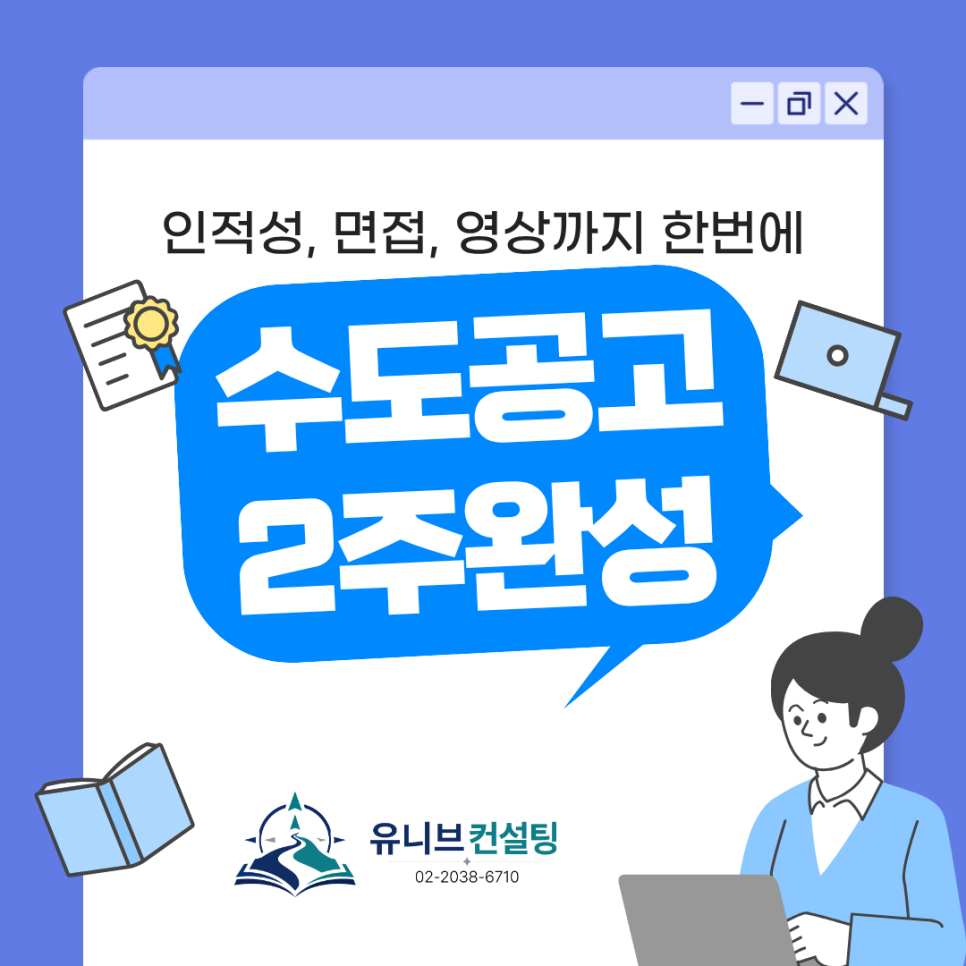

안녕하세요, 유니브 고입 입시센터입니다 👋

수도공고(수도전기공업고등학교) 진학을 준비하는  
중3 학생과 학부모님께 반가운 소식을 전해드려요! 🎉
 
2027학년도 수도공고 입학전형일은 10월 29일(목)이에요.  
이제 한 달도 채 남지 않았습니다.
 
남은 시간을 가장 효율적으로 쓸 수 있도록  
인적성검사, 면접, 영상 촬영 대비까지 한 번에 끝내는  
'수도공고 대비 2주 완성반'을 개설합니다! ⚡

## 🔌 수도공고, 왜 이렇게 인기가 많을까요?
 
수도전기공업고등학교는 한국전력공사가 운영하는  
에너지 분야 마이스터고등학교예요.
 
1924년 경성고등예비학교 전기부에서 출발해  
100년 넘게 전기 기술인을 길러 온 전통의 학교죠. 🏫
 
✔ 전기에너지과  
✔ 에너지전자제어과  
✔ 에너지기계과  
✔ 에너지정보통신과
 
4개 학과에서 에너지 분야의 '영마이스터'를 키웁니다.  
 
졸업 후에는 한국전력공사, 한국수력원자력,  
발전소와 협력회사 등으로 많이 진출하는데요.  
2024학년도 졸업생 취업률은 무려 97.7%였어요. 💡
 
서울 외 지역 학생을 위한 기숙사도 운영하고 있어  
전국 단위로 신입생을 모집합니다.

## 📋 2027학년도 수도공고 입시, 일정부터 체크!
 
✔ 온라인 원서 입력 : 10/12(월)부터  
✔ 원서 접수 : 10/19(월) 09:00 ~ 10/22(목) 17:00  
✔ 입학 전형 : 10/29(목)  
✔ 합격자 발표 : 11/4(수)
 
모집 인원은 총 180명이에요.  
전기에너지과 72명, 나머지 3개 학과는 각 36명이고  
일반전형 107명, 특별전형 73명을 선발합니다.
 
특별전형(마이스터인재·봉사활동우수자·사회통합)은  
일반전형과 동시에 지원할 수 있어요.  
특별전형에서 아쉽게 떨어져도  
일반전형으로 한 번 더 도전할 수 있다는 뜻이죠. 🙌
 
단, 마이스터고를 포함한 전기고등학교는  
전국에서 단 1곳만 지원할 수 있어요.  
(마이스터고에 불합격하면 특성화고에는 지원 가능)  
그만큼 지원 전략을 신중하게 세워야 합니다.

## ⚖️ 합격을 가르는 건 '전형일의 150점'입니다
 
수도공고 입학전형은 300점 만점이에요.
 
✔ 교과성적 : 90점  
✔ 출결 30점 · 봉사활동 30점 (봉사는 전원 만점)  
✔ 마이스터 적성·소양검사 : 90점  
✔ 심층면접 : 60점  
※ 특별전형은 학업계획영상 30점 + 심층면접 30점
 
여기서 중요한 포인트!  
적성·소양검사와 면접(특별전형은 영상 포함)이  
무려 150점, 전체의 절반을 차지합니다. 🔥
 
학교에서도 교과성적이 높은데 불합격하거나  
더 낮은데 합격한 경우가 있다고 안내할 정도예요.
 
최근 3년 평균 합격선은 300점 만점에  
일반전형 약 225점, 특별전형 약 230점이었고,  
올해는 특별전형 방식이 바뀌어 합격선이  
더 낮아질 수 있다는 게 학교 측 예측이에요.
 
내신이 조금 아쉬워도  
전형일 준비로 충분히 역전을 노릴 수 있는 구조입니다. 💪

## 📌 수도공고 대비 2주 완성반, 이렇게 운영됩니다
 
✔ 수업 기간 : 10/12(월) ~ 10/22(목), 2주 과정  
✔ 수업 요일 : 매주 월·화·수·목 (총 8회)  
✔ 수업 시간 : 1부 오후 6:00~7:30 / 2부 오후 8:00~9:30  
✔ 수강 방법 : 1부, 2부 중 원하는 시간 선택  
✔ 수강료 : 25만 원  
✔ 수업 진행 : 김류빈 대표원장 직강
 
수업 첫날(10/12)은 온라인 원서 입력이 열리는 날,  
마지막 날(10/22)은 원서 접수가 마감되는 날이에요.
 
원서 준비부터 전형일 직전까지,  
가장 중요한 2주를 빈틈없이 함께합니다. 🎯
 
평일 저녁 수업이라 학교생활과 병행하기에도 부담 없어요.

## 🧩 인적성·면접·영상, 2주 동안 이렇게 준비합니다
 
### 1️⃣ 마이스터 적성·소양검사 대비

적성검사는 135문항을 약 50분 안에 풀고,  
인성검사는 214문항에 약 40분 동안 답해야 해요.  
언어이해력·응용계산력·공간지각력·문제해결력 모두  
문제 난도보다 '시간'과의 싸움이 핵심이에요.  
오답 감점이 없어 끝까지 푸는 요령도 중요합니다.  
👉 영역별 유형 익히기 + 실전 시간 배분 훈련
 
### 2️⃣ 심층면접 대비

직업기초능력 면접은 미리 공개되는 예비문항 중에서,  
문제해결능력 면접은 당일 제시되는 상황으로 진행돼요.  
👉 두괄식 답변 구조화 + 실전 모의면접으로 즉석 대응력까지
 
### 3️⃣ 학업계획영상 촬영 대비

특별전형 지원자는 원서 접수 때 영상을 온라인으로 제출해요.  
도전정신·가치관·학업 계획성 등이 평가 포인트예요.  
👉 평가 요소에 맞춘 스토리 구성 + 카메라 앞 전달력 연습
 
김류빈 대표원장이 직접 만든 자체 교재에는  
기출문제와 예상문제가 가득 담겨 있어요. 📚
 
특성화고·마이스터고 입시 전문가 김류빈 대표원장이  
처음부터 끝까지 직접 지도합니다.

## 👨‍🏫 검증된 컨설턴트진이 함께합니다
 
✔ 김류빈 대표원장 — 메가스터디SW입시센터 대표 컨설턴트 출신  
메가스터디IT아카데미 고입 강사·컨설턴트  
영재학교·고려대 컴퓨터학과, 특성화고·마이스터고 입시 전문가
​

✔ 성우용 컨설턴트 — 전자계열 특성화고 출신, 전자계열 기업 경력 다수  
전기전자·반도체, 고입 면접·마이스터고 담당
​

✔ 심훈 컨설턴트 — 메가스터디SW입시센터 대표 강사 출신  
IT특성화고·숭실대 컴퓨터학부, 고입 면접·내신 전략
​

✔ 심준 컨설턴트 — 메가스터디SW입시센터 대표 강사 출신  
IT특성화고·국민대 SW학과, 선린인터넷고 정보올림피아드반 강사, 로봇·임베디드
​
그 외에도 각 분야의 전문 컨설턴트들이 함께합니다.
 
최근 3년간 한성과학고·용인외대부고·한국디지털미디어고·선린인터넷고·수도전기공고 등  
주요 고교 진학을 지도해온 탄탄한 실적을 갖추고 있어요. 🏆
 
특히 수도전기공고·서울로봇고·경기게임마이스터고 등  
마이스터고 합격생을 직접 지도한 경험까지 갖췄습니다.

## 📅 10월 12일 개강, 지금 바로 신청하세요!
 
개강까지 2주도 채 남지 않았어요.  
1부·2부 모두 원하는 시간이 마감되기 전에  
서둘러 신청해 주세요. 😊
 
적성·소양검사, 심층면접, 학업계획영상까지  
합격의 절반을 좌우하는 준비,  
유니브 고입 입시센터와 2주 만에 끝내세요! 🎯

📞 전화 문의 : 02-2038-6710      
📩 카카오톡 : https://pf.kakao.com/_xbfEKX/chat

---

