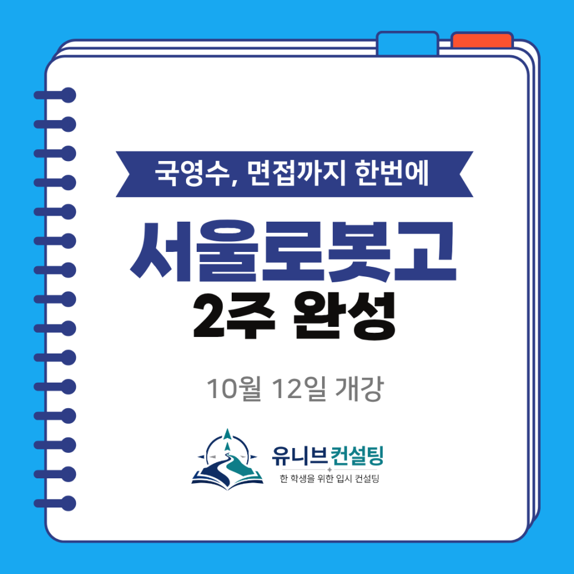

안녕하세요, 유니브 고입 입시센터입니다 👋
 
서울로봇고(서울로봇고등학교) 진학을 준비하는  
중3 학생과 학부모님께 반가운 소식을 전해드려요! 🎉
 
마이스터고 원서 접수가 10월 19일(월)부터 시작돼요.  
이제 본격적인 실전 준비가 필요한 시기입니다. 
 
로봇고 합격의 관문인 국어·영어·수학 시험과 면접,  
이 두 가지를 2주 만에 끝내는  
'로봇고 대비 2주 완성반'을 개설합니다! 🤖

## 🤖 서울로봇고, 어떤 학교일까요?
 
서울로봇고등학교는 서울 강남구 일원동에 있는  
로봇 분야 마이스터고등학교예요.
 
✔ 로봇설계과  
✔ 로봇제어과  
✔ 로봇소프트웨어과  
✔ 로봇정보통신과
 
4개 학과에서 로봇의 설계부터 제어, 소프트웨어,  
정보통신까지 로봇 기술 전반을 배울 수 있어요.
 
마이스터고는 산업 현장이 원하는 기술 인재를 길러내는 학교예요.  
로봇·자동화 분야의 '영마이스터'를 꿈꾼다면  
꼭 한 번 도전해 볼 만한 학교입니다. 🦾

## 📋 로봇고 입시, 이렇게 진행돼요
 
마이스터고 입시는 보통 교과성적·출결·봉사활동을 보는  
서류 평가에서 시작해 필기시험과 면접으로 이어져요.
 
특히 서울 마이스터고는 교과성적 반영 비율이  
일반전형 50% 이하로 정해져 있어요.  
나머지는 출결·봉사 같은 인성 요소와 면접,  
학교별 평가 요소가 채우는 구조죠.
 
서울로봇고에서는 국어·영어·수학 시험과 면접이  
합격을 가르는 핵심 관문이에요.
 
내신이 조금 아쉬워도  
시험과 면접 준비로 충분히 역전을 노릴 수 있다는 뜻입니다. 💪
 
※ 세부 전형 일정과 배점은 서울로봇고 입학 홈페이지 공지를 꼭 확인하세요.

## 📌 로봇고 대비 2주 완성반, 이렇게 운영됩니다
 
✔ 수업 기간 : 10/12(월) ~ 10/22(목), 2주 과정  
✔ 수업 요일 : 매주 월·화·수·목 (총 8회)  
✔ 수업 시간 : 1부 오후 6:00~7:30 / 2부 오후 8:00~9:30  
✔ 수강 방법 : 1부, 2부 중 원하는 시간 선택  
✔ 수강료 : 25만 원  
✔ 수업 진행 : 특성화고·마이스터고 입시 전문가 컨설턴트 직강
 
원서 접수 전 한 주, 그리고 원서 접수 주간 한 주.  
합격을 준비하는 가장 중요한 2주를 빈틈없이 함께합니다. 🎯
 
평일 저녁 수업이라 학교생활과 병행하기에도 부담 없어요.

## 🧩 국영수 시험·면접, 2주 동안 이렇게 준비합니다
 
### 1️⃣ 국어·영어·수학 시험 대비
마이스터고 필기시험은 보통 중학교 교육과정의  
기초 학력 수준에서 출제돼요.  
쉬워 보여도 실수 없이 정확하게 푸는 힘이 점수를 가릅니다.  
👉 과목별 핵심 개념 총정리 + 기출·예상문제 실전 풀이
 
### 2️⃣ 면접 대비
마이스터고 면접은 기본 자세와 지원 동기, 전공 이해도,  
인성과 진로 계획까지 종합적으로 평가해요.  
'왜 로봇고인가'에 대한 나만의 답이 필요하죠.  
👉 두괄식 답변 구조화 + 실전 모의면접으로 꼬리 질문까지
 
모든 수업은 직접 만든 자체 교재로 진행되며,  
기출문제와 예상문제가 가득 담겨 있어요. 📚
 
특성화고·마이스터고 입시 전문가 컨설턴트 선생님이  
처음부터 끝까지 직접 지도합니다.

## 👨‍🏫 검증된 컨설턴트진이 함께합니다
 
✔ 김류빈 대표원장 — 메가스터디SW입시센터 대표 컨설턴트 출신  
메가스터디IT아카데미 고입 강사·컨설턴트  
영재학교·고려대 컴퓨터학과, 특성화고·마이스터고 입시 전문가
​
✔ 심준 컨설턴트 — 메가스터디SW입시센터 대표 강사 출신  
IT특성화고·국민대 SW학과, 로봇 프로그래밍·임베디드·피지컬AI  
선린인터넷고 정보올림피아드반 강사
​
✔ 성우용 컨설턴트 — 전자계열 특성화고 출신, 전자계열 기업 경력 다수  
전기전자·반도체, 고입 면접·마이스터고 담당
​
✔ 심훈 컨설턴트 — 메가스터디SW입시센터 대표 강사 출신  
IT특성화고·숭실대 컴퓨터학부, 고입 면접·내신 전략
​
그 외에도 각 분야의 전문 컨설턴트들이 함께합니다.
 
최근 3년간 한성과학고·용인외대부고·한국디지털미디어고·선린인터넷고·서울로봇고 등  
주요 고교 진학을 지도해온 탄탄한 실적을 갖추고 있어요. 🏆
 
특히 서울로봇고·수도전기공고·경기게임마이스터고 등  
마이스터고 합격생을 직접 지도한 경험까지 갖췄습니다.

## 📅 10월 12일 개강, 지금 바로 신청하세요!
 
개강까지 2주도 채 남지 않았어요.  
1부·2부 모두 원하는 시간이 마감되기 전에  
서둘러 신청해 주세요. 😊
 
국어·영어·수학 시험부터 면접까지,  
로봇고 합격을 위한 결정적인 2주,  
유니브 고입 입시센터가 함께할게요! 🎯
 
📞 전화 문의 : 02-2038-6710
📩 카카오톡 : https://pf.kakao.com/_xbfEKX/chat

---

