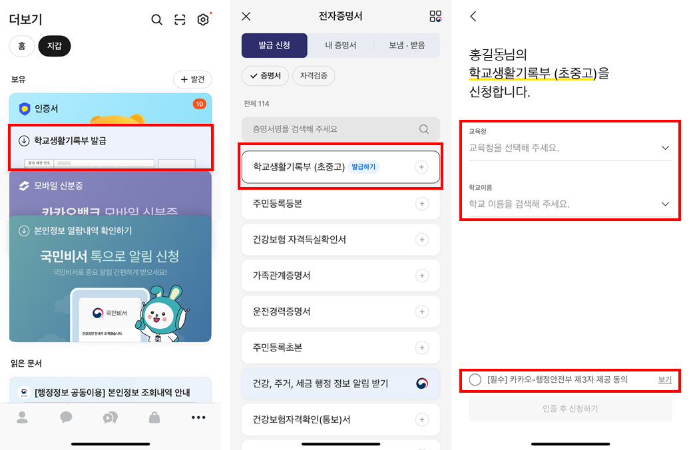
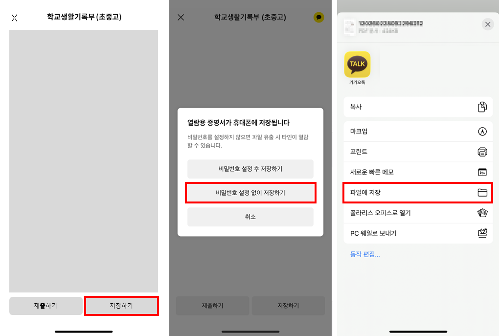
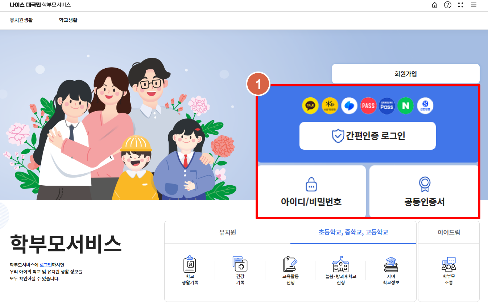
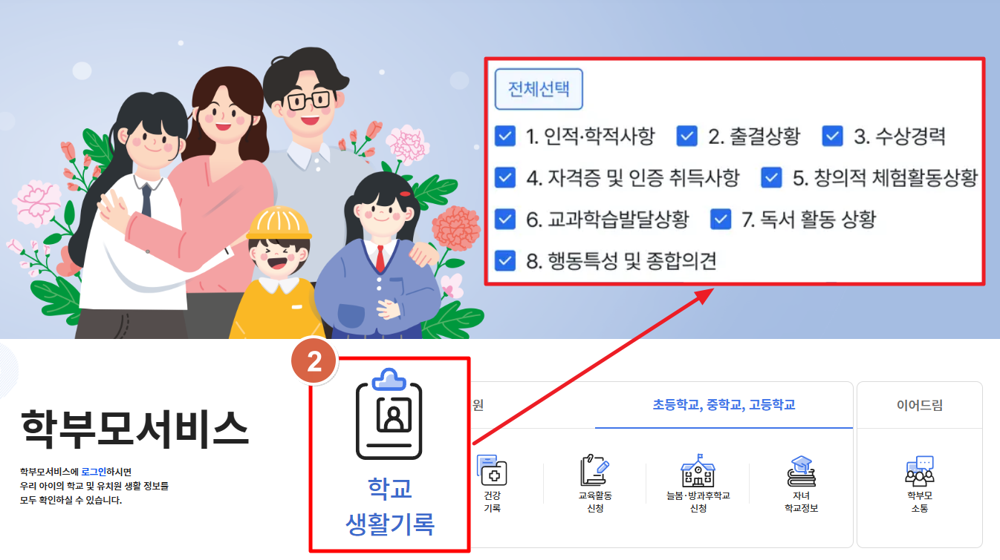
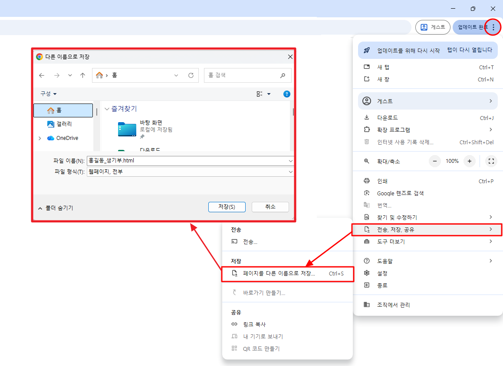
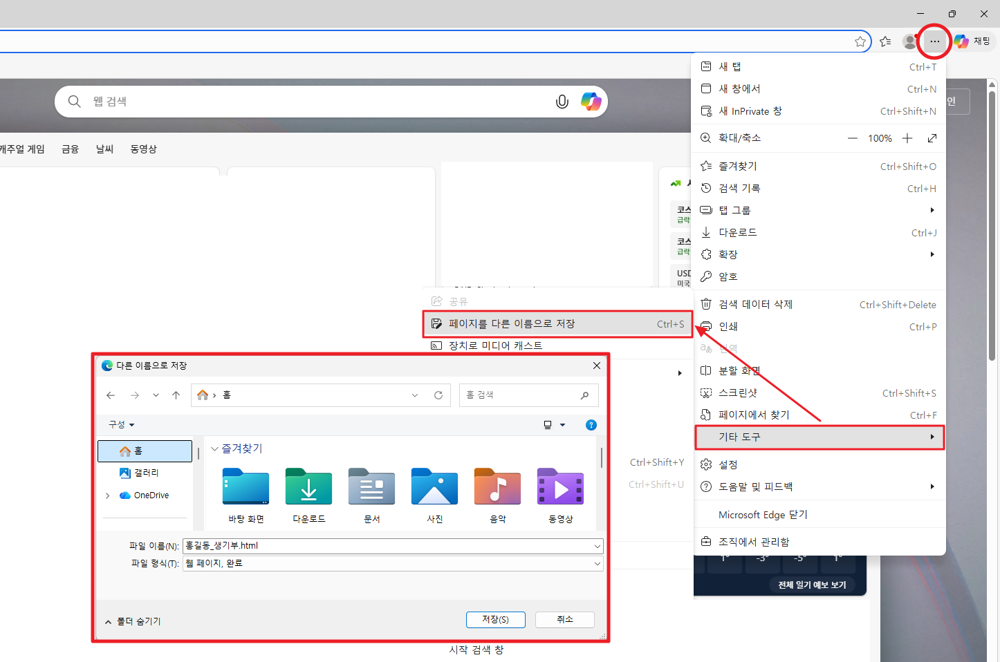

# 학교생활기록부 다운로드 및 제출 방법 안내

> 원활한 서류 검토 진행을 위해,  
> 반드시 PDF 형식으로 변환하여 제출해 주시기 바랍니다.  
>
> 사진 파일 등 다른 형식의 파일은 확인이 어렵습니다.  
> 도움이 필요하신 경우 센터로 문의해 주세요.

[toc]
 
## 학생 다운로드 가이드

### 1. 카카오톡 학교생활기록부 PDF 다운

※ 학생 본인 명의 계좌가 있어야 카카오톡 발급이 가능합니다. 

#### STEP 01 - 카카오톡에서 생기부 발급받기

**1. 카카오톡 지갑 메뉴 접속**

카카오톡 앱 실행 → 우측 하단 더보기 탭 → 지갑 선택 → 발견 메뉴 클릭

**2. 학교생활기록부 발급 메뉴 선택**

검색 또는 스크롤을 통해 '학교생활기록부(초중고)' 메뉴를 찾아 선택합니다.

**3. 발급 정보 입력 및 신청**

출신 학교의 소속 교육청과 학교이름을 입력한 후, 본인인증을 완료하고 신청하기 버튼을 눌러 발급을 완료합니다.

#### STEP 02 - 발급된 생기부 선택 후 PDF로 저장하기

**1. 저장하기 버튼 클릭**

**2. 비밀번호 설정 없이 저장하기 클릭**

**3. 파일에 저장 선택**

#### STEP 03 - 학교생활기록부 PDF 파일 제출하기

다운로드 받은 파일을 **메가입시컨설팅 오픈 카카오톡**에 제출해 주세요.

※ [카톡 오픈채팅 URL 바로가기](https://open.kakao.com/o/sbfmucti)

## 학부모 다운로드 가이드

### 1. 나이스 대국민 학부모 서비스 (HTML)

※ 반드시 PC에서 진행해 주세요.(모바일 진행 불가능)

#### STEP 01 - 사이트 접속하기 (https://parents.neis.go.kr/)

**1. 사이트 회원가입**

비회원의 경우 사이트 첫 이용 시 회원가입 절차가 필요합니다.

**2. 로그인 선택**

공인인증서/간편인증(카카오, PASS등) 또는 아이디/비밀번호 로그인합니다. 

※ 최초 이용 시 '자녀등록' 절차가 필요합니다. → [등록방법](https://parents.neis.go.kr/csp-prnt/#/prn-main/nts-ntc/nts-ntc-mg001)

#### STEP 02 - 학교생활기록 메뉴 선택하기

**1. 학교생활기록 메뉴 선택**

**2. 학교생활기록의 체크박스 항목 '모두' 선택**  
①인적·학적사항 ②출결상황 ③수상경력 ④자격증 및 인증 취득사항 ⑤창의적 체험활동상황 ⑥교과학습발달상황 ⑦독서 활동 상황 ⑧행동특성 및 종합의견

#### STEP 03 - HTML 파일 저장하기

**1. 브라우저 페이지 메뉴 선택**

브라우저(크롬, 엣지)의 페이지 저장 기능을 활용해 문서를 저장합니다.

**2. 파일 형식 선택 후 저장**

파일 형식은 웹페이지, 전부 또는 웹페이지, 완료로 설정해 주세요.

> ■ 크롬 브라우저 저장 방법  
> 1) 오른쪽 상단의 더보기(···)를 선택합니다  
> 2) 전송, 저장, 공유 → 페이지를 다른 이름으로 저장을 선택합니다.  
> 3) 파일 형식(웹페이지, 전부)을 선택한 후 저장 버튼을 클릭합니다.  

> ■ 엣지 브라우저 저장 방법
> 1) 오른쪽 상단의 더보기(···)를 선택합니다
> 2) 기타 도구 → 페이지를 다른 이름으로 저장을 선택합니다.
> 3) 파일 형식(웹페이지, 완료)을 선택한 후 저장 버튼을 클릭합니다.

#### STEP 04 - 학교생활기록부 PDF 파일 제출하기

다운로드 받은 파일을 **유니브컨설팅 카카오톡 채널**에 제출해 주세요.

※ [카톡 오픈채팅 URL 바로가기](https://pf.kakao.com/_xbfEKX)

---

