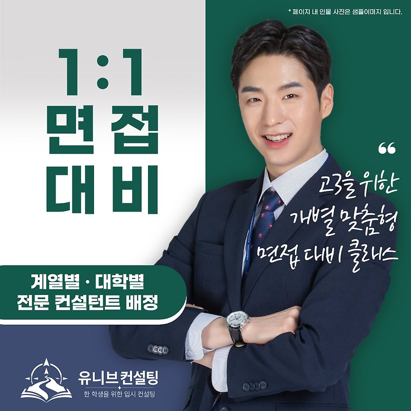

안녕하세요, 유니브 대입 입시센터입니다 👋
 
9월, 수시 원서 접수가 마무리되면 곧바로  
많은 수험생에게 '면접'이라는 마지막 관문이 찾아옵니다. 🚪
 
서류와 성적이 비슷한 지원자들 사이에서  
최종 합격을 가르는 건 결국 면접 10~15분인 경우가 많아요.
 
오늘은 그 짧은 시간을 제대로 준비할 수 있는  
유니브 대입 입시센터의 대입 면접 컨설팅을 소개해 드릴게요. 😊

## 🎤 면접, 왜 따로 준비해야 할까요?
 
 
학생부종합전형 면접은 '아는 걸 말하는 시험'이 아니에요.  
면접관은 학생부에 적힌 활동을 하나하나 짚으며  
진짜 학생 본인의 경험인지 확인합니다. 🔍
 
그래서 한 번 답하고 끝나는 게 아니라    
"왜 그렇게 생각했나요?" 같은 꼬리 질문이 이어지죠.
 
머릿속으로만 준비하면 실전에서 말이 꼬이기 쉬워요.   
실제 환경에서 말해보고, 영상으로 확인하고, 고쳐보는 과정이  
면접 준비의 핵심입니다. 💡

## 📌 대입 면접 컨설팅, 이렇게 운영됩니다
 
 
✔ 진행 방식 : 1:1 개인 컨설팅    
✔ 진행 시간 : 3시간 × 2회, 총 6시간    
✔ 수업 형태 : 대면 / 비대면 모두 가능
​
✔ 신청 대상 : 면접을 앞둔 고3·재수생 및 학부모    
✔ 신청 시기 : 9월 ~ 12월 (면접 2주 전 권장)    
✔ 제출 서류 : 학교생활기록부, 지원 대학 수험표
 
비대면도 가능하지만, 실제 면접장과 같은 긴장감 속에서    
시선·자세·목소리 톤까지 세밀하게 잡아드리기 위해    
가급적 대면 진행을 권장드려요. 🙌
 
기본은 6시간이지만, 지원 대학 수나 학생의 준비 상태에 따라    
필요한 경우 시간을 연장해 더 꼼꼼하게 진행할 수 있습니다.

## 🧩 6시간, 이렇게 채워집니다
 
 
### 1️⃣ 서류 기반 예상 질문 분석    
평가위원의 시선으로 학생부 전반을 분석해    
출제 가능성이 높은 핵심 질문 리스트를 만들어요.
 
### 2️⃣ 답변 구조화 및 두괄식 트레이닝
결론부터 말하는 두괄식 답변을 몸에 익히고  
꼬리 질문에도 흔들리지 않도록 대응법을 연습합니다.
 
### 3️⃣ 1차 모의면접 + 영상 피드백
실제 면접과 동일한 환경에서 모의면접을 진행하고  
촬영 영상을 함께 보며 답변과 태도를 정밀하게 다듬어요.
 
### 4️⃣ 2차 모의면접 + 즉시 교정
피드백을 반영해 한 번 더 실전처럼 연습하고  
그 자리에서 바로 교정한 뒤 당일 체크리스트로 마무리!
 
여기에 대학별로 다른 면접 유형과 평가 기준까지 반영해  
지원 대학에 최적화된 답변 전략을 설계합니다. 🎯

## 🎁 컨설팅 후 이런 자료를 받아가요
 
 
✔ 서류 기반 예상 질문 리스트  
학생부에서 뽑은 핵심 질문을 카테고리별로 정리해 드려요.
 
✔ 모의면접 영상 · 피드백 노트  
두 차례 모의면접 영상과 정밀 피드백을 함께 제공합니다.
 
✔ 면접 당일 체크리스트  
복장·동선·답변 톤까지 당일 챙길 항목을 정리해 드려요.
 
컨설팅이 끝난 뒤에도 혼자 반복 연습할 수 있는 자료가  
그대로 남는다는 점이 큰 장점이에요. 📂

## 👨‍🏫 검증된 컨설턴트진이 직접 지도합니다
 
 
✔ 김류빈 대표원장 — 메가스터디SW입시센터 대표 컨설턴트 출신  
광주과학영재학교·고려대학교 컴퓨터학과, 학생부종합·면접 전략 총괄
​
✔ 심준 컨설턴트 — 메가스터디SW입시센터 대표 강사 출신  
국민대학교 SW학과, 선린인터넷고 정보올림피아드반 강사, 학생부종합·면접 담당
​
✔ 문준수 컨설턴트 — 메가스터디SW입시센터 특기자반 강사 출신  
한국외국어대학교 컴퓨터공학과·정치외교학과, SW인재·면접 담당
​
✔ 진은재 컨설턴트 — 메가스터디SW입시센터 특기자반 강사 출신  
한국과학영재학교·KAIST 전산학부, 경시대회 출제위원, 특기자·면접 담당
​
그 외에도 각 분야의 전문 컨설턴트들이 함께합니다.
 
최근 3년간 KAIST·서울대·고려대·연세대·중앙대 등  
주요 대학 진학을 지도해온 탄탄한 실적을 갖추고 있어요. 🏆

## 💰 비용 및 신청 안내
 
 
✔ 비용 : 1,080,000원 ➡️ 600,000원 (44% 할인)  
(2학기 시작 특별 할인가 연장)    
✔ 할인 기간 : 2026년 10월 17일까지
 
## 📝 신청 절차
### ① 아래 링크에서 비용 결제
https://univconsulting.kr/item?p=200005#checkout

### ② 결제 후 카카오톡으로 아래 내용을 알려주세요
   - 면접을 희망하시는 대학
   - 지원 학과
   - 희망 수업 일정
### ③ 확인 후 담당 컨설턴트가 자세히 안내드립니다
### ④ 프로그램 최소 3일 전까지 자료 제출 후 진행
 
면접 시즌에는 일정이 빠르게 마감되니  
가급적 일찍 신청해 주시는 걸 추천드려요. ⏰

## 📅 합격을 결정짓는 6시간, 지금 준비하세요!
 
 
면접은 준비한 만큼 보이는 전형이에요.  
막연한 불안 대신, 두 번의 실전 연습으로 만든 자신감을  
면접장에 가지고 들어가세요. 💙
 
단 한 명의 학생을 위한, 단 하나의 합격 전략.  
유니브 대입 입시센터가 끝까지 함께하겠습니다. 🎯
 
📞 전화 문의 : 02-2038-6710  
📩 카카오톡 : https://pf.kakao.com/_xbfEKX/chat

---

