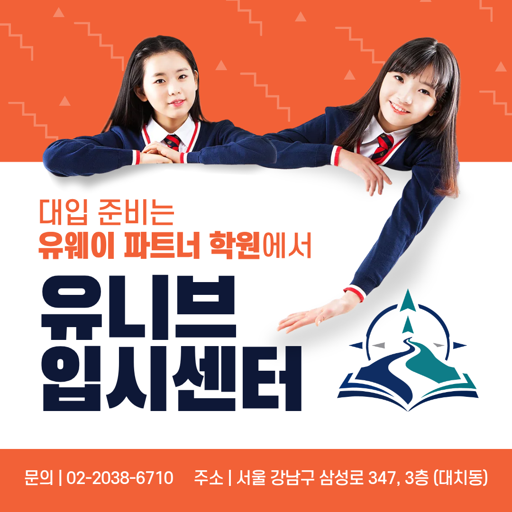
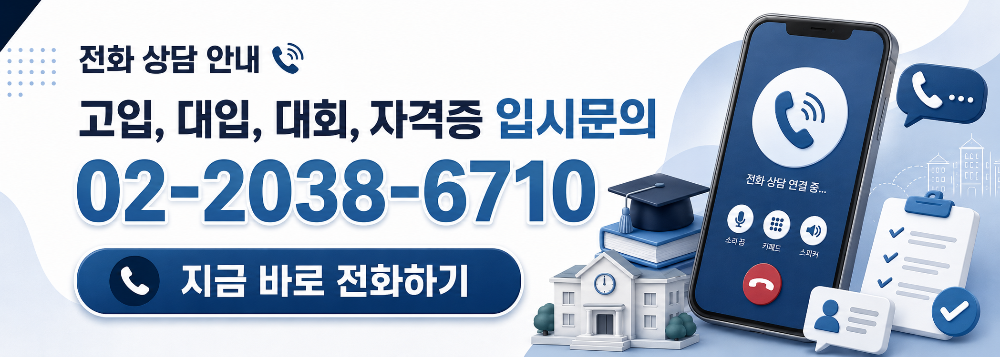

안녕하세요, 유니브 대입 입시센터입니다 👋
 
오늘은 정말 기쁜 소식을 전해드리려고 해요. 🎉  
유니브 대입 입시센터가 대한민국 대표 입시기관  
유웨이(Uway)의 공식 파트너 학원으로 함께하게 되었습니다!
 
입시를 준비하는 학생과 학부모님이라면  
'유웨이'라는 이름, 한 번쯤은 들어보셨을 거예요.  
원서접수부터 합격진단까지, 대입의 길목마다 있는 곳이죠.
 
그런 유웨이와 이제 같은 방향을 바라보게 되었습니다. 🌱

## 🏛️ 유웨이, 어떤 곳일까요?
 
 
유웨이는 1999년 문을 연 뒤 27년 동안  
대한민국 대입 현장을 지켜온 입시 전문 기관이에요.
 
✔ 유웨이어플라이 — 대한민국 대표 대입 원서접수 사이트  
✔ 합격진단 — 50만 수험생과 진학교사가 선택한 서비스  
✔ 파워경쟁률 — 전국 대학·학과 경쟁률을 실시간으로  
✔ 교육평가연구소 — 입시 변화를 신속하게 분석하는 전문가 집단  
✔ 대입 전문가 양성 — 15년 넘게 5,000명 이상의 입시 전문가 배출
 
특히 유웨이 합격진단은 다년간의 실제 합격자 결과에  
그해의 입시 이슈까지 더해 합격 가능성을 진단해요.
 
수험생이 원서를 쓰는 순간에도, 합격선을 따져보는 순간에도  
그 뒤에는 늘 유웨이의 데이터가 있었습니다. 📊

## 💡 '유웨이 파트너 학원'이 왜 특별할까요?
 
 
유웨이는 전국의 진로진학센터와 파트너 학원을 통해  
오프라인 입시 컨설팅을 운영하고 있어요.
 
27년간 입시 데이터를 다뤄온 기관이  
자신의 이름을 걸고 소개하는 곳이라는 것.  
그만큼 컨설팅의 전문성과 신뢰를 인정받았다는 의미예요. 💪
 
광고 문구가 아니라, 입시 전문 기관이 함께하기로 한 곳.  
학부모님께서 학원을 고르실 때 가장 확실한 기준이 됩니다.

## 🔗 유웨이의 데이터 × 유니브의 1:1 전략
 
 
입시 컨설팅의 정확도는 결국 두 가지에서 갈려요.
 
하나, 얼마나 정확한 데이터를 보느냐  
둘, 그 데이터를 학생 한 명에게 얼마나 정밀하게 맞추느냐
 
✔ 데이터의 힘 — 누적된 합격 결과와 실시간 입시 흐름  
✔ 사람의 힘 — 학생부·성적·활동을 한 명씩 들여다보는 1:1 설계
 
유니브 대입 입시센터는 유웨이 파트너 학원으로서  
유웨이가 쌓아온 입시 흐름과 데이터를 바탕에 두고,  
유니브만의 '한 학생을 위한 컨설팅'을 더 정교하게 만들어갑니다.
 
여기에 SW·AI인재전형, 특기자전형처럼  
일반 컨설팅에서 놓치기 쉬운 전형까지  
SW·AI 입시 전문 컨설턴트들이 직접 설계해요.
 
전략의 차이가 결과의 차이를 만듭니다. 🎯

## 🤔 그래서, 대입은 왜 유니브입시센터일까요?
​
 
### 1️⃣ 검증된 기관  
유웨이가 함께하기로 한 공식 파트너 학원입니다.
 
### 2️⃣ 검증된 실적  
최근 3년간 KAIST·서울대·고려대·연세대 등  
주요 대학 진학을 컨설턴트가 직접 지도했어요.  
특성화고 7등급 초반에서 KAIST, 자사고 6등급 중반에서 연세대.  
내신 숫자만으로는 설명되지 않는 합격, 그게 바로 전략입니다.
 
### 3️⃣ 검증된 사람  
학생이 목표로 하는 그 학교 출신 선배 컨설턴트들이  
책상 위 이론이 아닌, 직접 겪은 입시로 함께합니다.
 
데이터, 실적, 사람. 이 세 가지를 모두 갖춘 곳에서  
대입을 준비하는 것이 가장 확실한 선택입니다. 🚀

## 📅 10월, 지금 꼭 챙겨야 할 컨설팅
 
 
수시 원서접수가 끝난 지금부터가 진짜 승부예요.  
학년별로 지금 필요한 컨설팅을 정리해 드릴게요.
 
### ✔ 고3·재수생 → 대입 면접 컨설팅 (240분)  
학생부 기반 예상 질문 + 2회 모의면접 + 영상 피드백  
👉 면접 2주 전까지 신청을 권장드려요
 
### ✔ 수능 이후 → 정시지원전략 컨설팅 (60분)
환산 점수 기반 합격선 분석 + 가·나·다군 최적 라인업
 
### ✔ 고1·고2 → 학생부종합 컨설팅 (60분)
남은 학기와 겨울방학을 채울 생기부 로드맵 설계
 
### ✔ SW·AI 진로 → SW·AI인재 / 특기자 컨설팅 (60분)
SW·AI 활동과 수상 실적을 평가자 시선에서 다시 정리
 
면접 컨설팅은 일정이 빠르게 마감되니 서둘러 주세요!

## 👨‍🏫 검증된 컨설턴트진이 직접 지도합니다
 
 
✔ 김류빈 대표원장 — 메가스터디SW입시센터 대표 컨설턴트 출신  
광주과학영재학교·고려대 컴퓨터학과, 학생부종합·특기자·면접 컨설팅

​
✔ 진은재 컨설턴트 — 메가스터디SW입시센터 특기자반 강사 출신  
한국과학영재학교·KAIST 전산학부, 경시대회 문제 출제위원, SW인재·특기자·면접
​

✔ 심훈 컨설턴트 — 메가스터디SW입시센터 대표 강사 출신  
숭실대 컴퓨터학부, SW인재·면접·내신 전략
​

✔ 박재영 컨설턴트 — 메가스터디SW입시센터 특기자반 강사 출신  
서울과기대 전자IT미디어공학과, 다수 논문 지도, 특기자·내신
​

그 외에도 각 분야의 전문 컨설턴트들이 함께합니다.
 
최근 3년간 KAIST·서울대·고려대·연세대·중앙대 등  
주요 대학 진학을 지도해온 탄탄한 실적을 갖추고 있어요. 🏆

## 📞 유웨이 파트너 학원, 유니브입시센터에서 시작하세요
 
 
유웨이가 인정한 전문성, 유니브가 쌓아온 실적.  
이제 대입은 유니브 대입 입시센터에서 준비하세요.
 
컨설팅은 최소 3일 전 예약,  
자료는 최소 2일 전 전달해 주시면 더 꼼꼼하게 준비해 드려요. 😊
 
📞 전화 문의 : 02-2038-6710  
📩 카카오톡 : https://pf.kakao.com/_xbfEKX/chat

---

