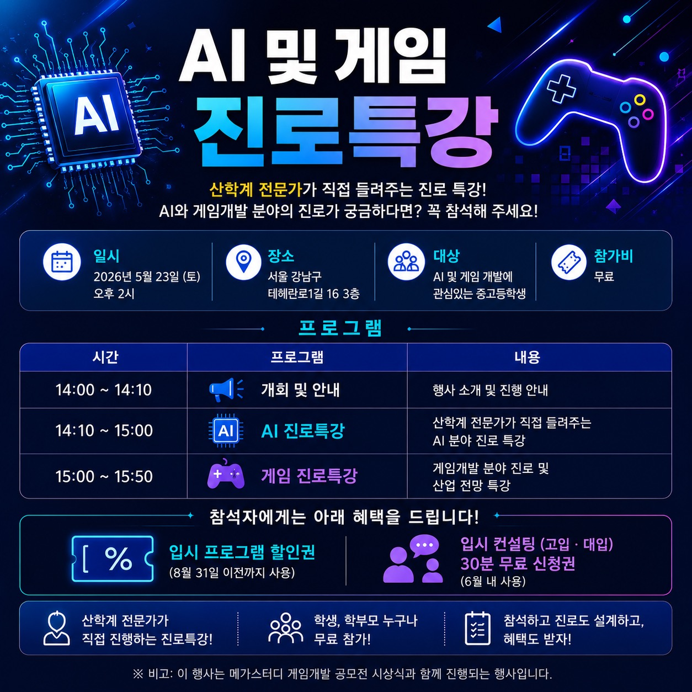

오는 5월 23일(토) 오후 2시, AI 및 게임 진로특강이 진행됩니다.

이번 특강은 AI와 게임개발 분야에 관심 있는 중·고등학생을 위해 마련된 자리로,  
산학계 전문가가 직접 AI 분야와 게임개발 분야의 진로 탐색 방법 및 산업 전망에 대해 설명해 주실 예정입니다.

📌 일시  2026년 5월 23일(토) 오후 2시  
📌 장소  서울 강남구 테헤란로1길 16, 3층 본원  
📌 대상  AI 및 게임 개발에 관심 있는 중·고등학생  
📌 참가비  무료

🎁 참석자 혜택  
- 입시 프로그램 할인권 (8월 31일 이전까지 사용)
- 입시 컨설팅(고입·대입) 30분 무료 신청권 (6월 내 사용)

AI와 게임개발 분야 진로가 궁금한 학생들은 아래 링크에서 꼭 참석 신청해주시기 바랍니다.

> 🔗  https://univconsulting.kr/event260523

---

