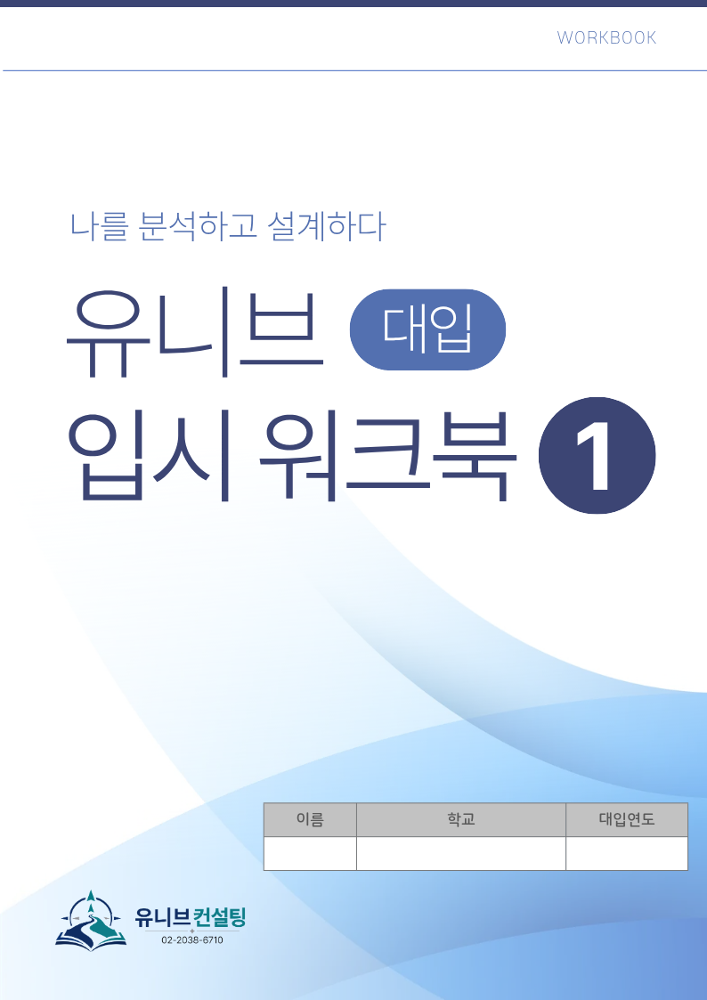

안녕하세요, 유니브컨설팅입니다 👋

6월 3일(수)는 지방선거일, 공휴일이에요. 🗳️  
이 하루, 어떻게 보내실 계획이신가요?

고등학생에게 공휴일 하루는 **입시 방향을 제대로 점검하는**  
황금 같은 시간이 될 수 있어요.

그래서 준비했습니다.  
**학생부종합전형 특강** 안내입니다! ✍️

👉 단, **선착순 20명 한정**으로 진행됩니다!

## 🎯 학년별로, 꼭 필요한 내용을 다릅니다

​**📕 고3 — 입시가 코앞! '필수' 점검 시간**

지금 생기부를 점검하고  
수시 원서 전 최종 전략을 세우는 시간  
👉 더 이상 미룰 수 없는, 마지막 정비의 기회예요.

​**📗 고1·고2 — 방향을 잡는 시간**

대입 전형이 어떻게 돌아가는지 이해하고  
앞으로 생기부를 어떻게 채워나갈지 알아보는 시간  
👉 일찍 방향을 잡을수록 3년이 달라집니다.

## 🎁 참가자 전원, 이것을 받아갑니다!

유니브컨설팅 대표 컨설턴트들이 직접 만든
**「유니브 대입 입시 워크북 1권」 증정! 📘**

단순한 자료집이 아니에요.  
대입 학종에서 **평가자가 중요하게 보는 핵심**을 한 권에 담았습니다.

​✔ 평가자의 눈으로 생기부 읽기  
✔ 생활기록부 영역별 뜯어보기  
✔ 생기부 분석 워크시트  
✔ 실적 정리법  
✔ 진로·전공 적합성과 연결 짓는 방법

​여기에 부록으로  
✔ **과목별(국·영·수·사·과) 고득점 전략**까지!

특강이 끝나도 **집에서 계속 활용할 수 있는** 든든한 무기예요. 💪

## 📌 특강 안내

​✔ 일시 : 2026년 6월 3일(수), 지방선거 공휴일  
고3 : 오후 7시 ~ 10시  
고1·고2 : 오후 3시 ~ 6시  

​✔ 장소 : 서울 강남구 테헤란로1길 16, 3층 본원  
✔ 정원 : 선착순 20명 한정 🔥   
✔ 신청 마감 : 5월 31일(일)까지 ⏰  

## 💰 참가비 안내

✔ 생기부 컨설팅 티켓 프로그램 수강생: 티켓 1장  
✔ 재원생: 정가 180,000원 → 90,000원 (50% 할인!)  
✔ 비재원생: 별도 문의 주세요 😊  

## ⏰ 선착순 20명, 마감되면 끝입니다!

✔ 정원 단 20명  
✔ 신청 마감 5월 31일(일)

소수 정원으로 진행되는 만큼 선착순으로 빠르게 마감될 수 있습니다.  
공휴일 하루를 알차게, 그리고 우리 아이의 입시 방향을 전문가와  
함께 제대로 잡아보는 시간.  

지금 바로 신청하세요! 🎯  

​📞 전화 문의 : 02-2038-6710  
📩 카카오톡 : https://pf.kakao.com/_xbfEKX/chat

---

