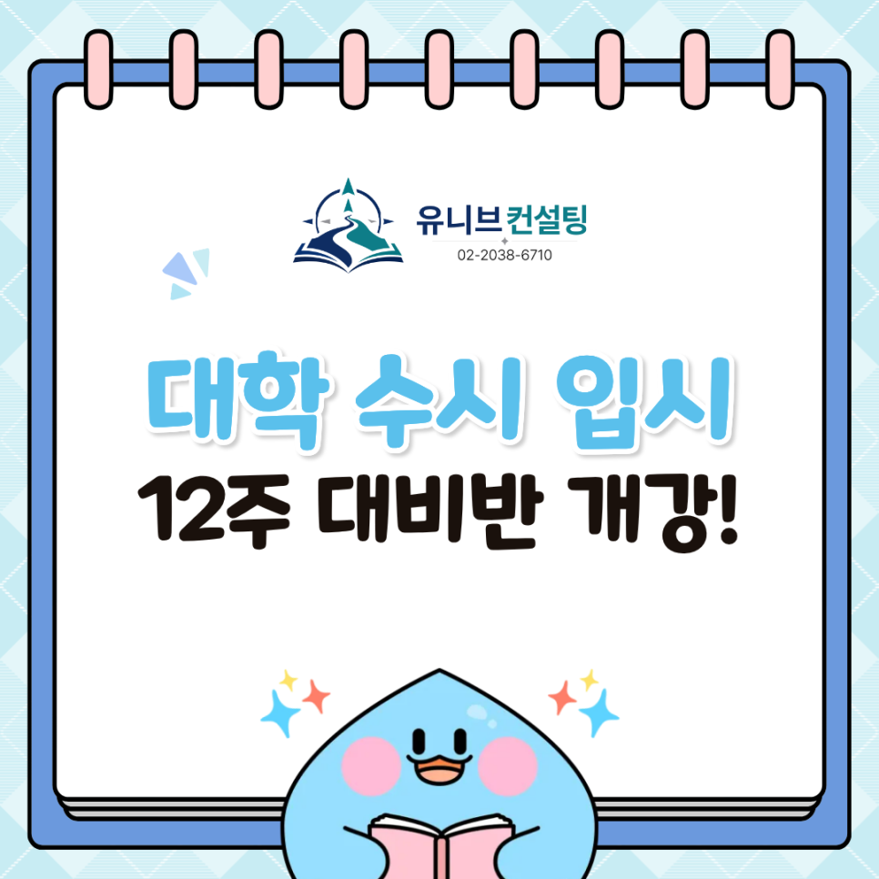

안녕하세요, 유니브컨설팅입니다 👋

곧 여름방학이에요. ☀️   
이번 여름, 우리 아이의 입시는 어떤 모습일까요?

6월 7일부터 8월 30일까지, 매주 일요일 12주 동안  
입시를 처음부터 끝까지 짚어가는  
'입시 본격 대비반'을 새롭게 엽니다. 🎉

## 🌟 왜 하필 '6월'일까요?

여름방학은 한 학기를 정리하고 다음 학기를 준비하는 황금기예요.

학기 중에는 시험과 수행평가에 쫓겨  
정작 입시 자체를 들여다볼 여유가 없죠. 😥

특히 요즘은 생기부 한 줄, 면접 답변 하나가  
당락을 가르는 시대입니다.

"활동을 많이 했느냐"보다  
"그 활동을 어떻게 설명할 수 있느냐"가 핵심이 됐어요.

이 여름, 그 답을 함께 정리해보면 어떨까요? 💪

## 📚 12주 커리큘럼 한눈에 보기

✔ 1\~2주차 : 생활기록부 분석하기  
✔ 3\~4주차 : 학년별 생기부 분석 및 워크시트 작성  
✔ 5주차 : 활동 이력 누적 기록 작성  
✔ 6주차 : 진로·전공 적합성과 연결 짓기  
✔ 7주차 : 희망 학교·학과 탐색  
✔ 8주차 : 관심 대학·학과 비교 조사  
✔ 9\~10주차 : 면접 유형 이해 및 예상 질문 대비  
✔ 11\~12주차 : 모의면접 자기평가 및 피드백 기록
​
생기부 읽기 → 활동 정리 → 진로 연결 → 학과 탐색 → 면접까지.
​
흩어져 있던 입시 준비를  
한 줄로 꿰어드립니다. 🎯

## 📌 수업, 이렇게 진행돼요
​
✔ 수업 시간 : 1회 2시간, 담당 컨설턴트 밀착 진행  
✔ 교재 : 무료 제공 (별도 비용 부담 없음)
​
✔ 수업 시간대 (편한 시간에 출석하세요)  
오전 1부(9:00\~11:00), 오전 2부(11:00\~13:00)  
오후 1부(13:30\~15:30), 오후 2부(15:30\~17:30)
​

학원 일정·자기주도학습 시간에 맞춰  
가장 편한 시간대를 고르면 됩니다. 😊

## 💡 유니브컨설팅 대비반이 다른 이유
​
✔ 한 명의 학생, 하나의 답  
평균이 아닌, 학생 한 명을 봅니다
​

✔ 생기부와 면접을 한 호흡으로  
흩어진 활동을 합격의 근거로 다시 엮습니다

​
✔ 선배와 함께하는 동행  
목표 대학 출신 컨설턴트들이 직접 지도합니다
​

자료를 채우기만 하는 수업이 아니라,  
대입 전형까지 내다보고 설계하는 12주예요. 💙

## 👨‍🏫 함께하는 컨설턴트진
​
✔ 김류빈 대표원장 - 영재학교·고려대 컴퓨터학과, 메가스터디SW입시센터 대표 컨설턴트 출신, 수시·정시 컨설팅  
✔ 심준 컨설턴트 — 서울 관내 학교 올림피아드반 강사 및 메가스터디SW입시센터 대표강사 출신, 대회·면접·프로젝트 전문  
✔ 문준수 컨설턴트 — 메가스터디SW입시센터 올림피아드반 강사 출신, 학생부종합·SW·AI전형 전문, 수시·면접컨설팅  
✔ 심훈 컨설턴트 — 메가스터디SW입시센터 대표강사 출신, 대회·면접·프로젝트 전문
​

최근 3년간 KAIST, 서울대, 고려대, 연세대, 중앙대 등  
주요 대학 진학을 지도해온 든든한 컨설턴트진이  
12주 내내 함께합니다. 🏆

## 📅 6월 7일 개강, 자리가 한정되어 있어요
​
소수정예로 운영되기 때문에  
자리가 빠르게 마감되는 편입니다.
​

여름이 시작되기 전에 큰 그림을 그려두면,  
2학기와 그 이후의 한 걸음이 훨씬 가벼워져요. 🌱
​

이번 여름, 입시의 출발선을 함께 그어볼까요? 🎯

​
📞 전화 문의 : 02-2038-6710  
📩 카카오톡 : https://pf.kakao.com/_xbfEKX/chat

---

