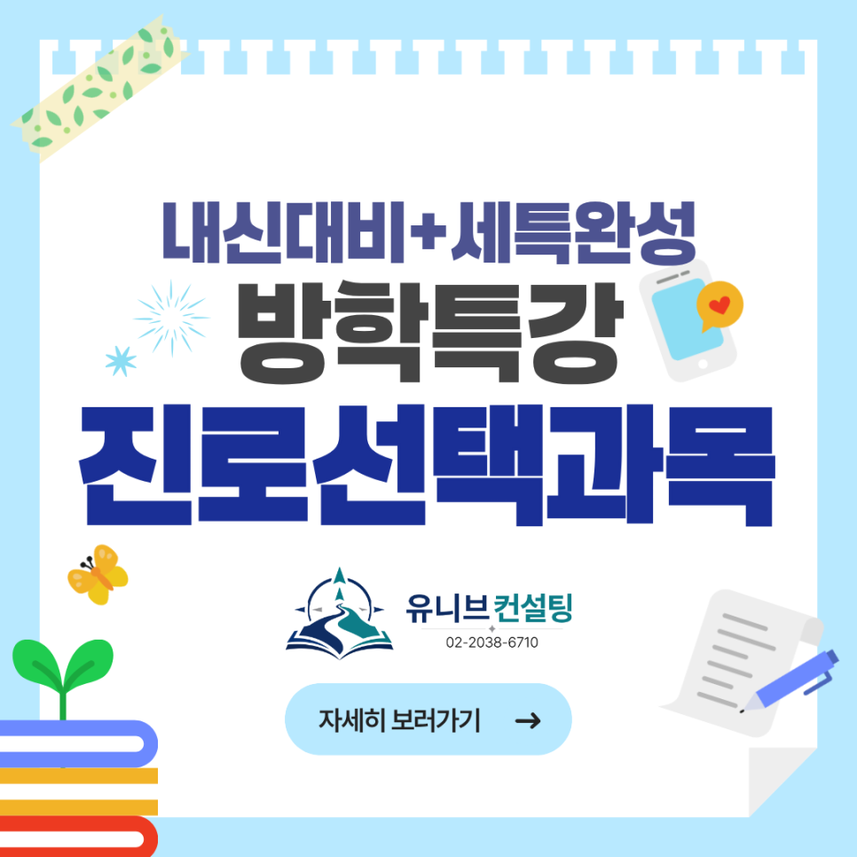

안녕하세요, 유니브컨설팅입니다 👋  
​

2026년 2학기를 미리 준비하는 분들을 위한 소식입니다!  
SW·AI 계열 선택과목 5종 방학 특강을 한 번에 오픈합니다. 🎉
​

선택과목은 단순히 한 과목이 아니라,  
학생의 진로를 '실력과 기록'으로 보여주는 무대예요.
​

방학이라는 시간을 활용해 미리 내신을 다지고,  
세특까지 완성해두는 것. 그게 가장 현명한 출발입니다. 🌱

## 📚 이번 방학, 이 5과목을 준비합니다
​
학생이 학교에서 선택한 과목, 또는 앞으로 선택할 과목에 맞춰 골라 들을 수 있어요.
​
### ▶ 진로선택과목

#### 1️⃣ 인공지능 기초
탐색·추론, 기계학습·딥러닝, AI 윤리와 프로젝트까지 — 직접 모델을 만들며 배우는 과목
​
#### 2️⃣ 데이터 과학
데이터 전처리·시각화, 회귀·군집·연관 분석 — 데이터로 직접 답을 찾아 증명하는 과목
​
#### 3️⃣ 인공지능 수학
집합·벡터·행렬, 확률·추세선·경사하강법 — AI 속에서 살아 움직이는 수학을 다루는 과목
​
### ▶ 융합선택과목
#### 4️⃣ 소프트웨어와 생활
피지컬 컴퓨팅·데이터 분석·시뮬레이션·SW 스타트업 — SW를 여러 분야와 엮어 문제를 푸는 과목
​
### ▶ 일반선택과목
#### 5️⃣ 정보
네트워크·빅데이터·알고리즘·프로그래밍·인공지능 — SW·AI 진로의 기본기를 잡는 핵심 과목

​
어떤 과목을 선택해도, 외워서 푸는 게 아니라 직접 만들어 증명하는 과목들입니다. 💪

## 📌 방학 특강, 이렇게 운영됩니다
​
✔ 수업 시간 : 과목별 총 20시간  
✔ 수업 방식 : 온라인 / 오프라인 선택 가능  
✔ 구성 인원 : 최소 3명 (소수 구성)  
✔ 일정 : 담당 컨설턴트 선생님과 직접 시간 조율하여 진행
​
학생 일정에 맞춰 유연하게 운영되고,  
온·오프라인 모두 가능해 지역과 상황에 관계없이 참여할 수 있습니다. 🎯

## 🧩 모든 과목이 '내신 → 세특 프로젝트'로 이어집니다
​
1단계 _ 교육과정 핵심 개념 정리  
각 과목 성취기준을 그대로 반영해 2학기 내신을 탄탄하게
​

2단계 _ 직접 다뤄보는 실습  
코드·데이터·모델·작품을 직접 만들어보며 개념을 체화
​

3단계 _ 세특 프로젝트 완성  
직접 만든 산출물과 보고서로 학생부에 남을 세특까지 완성
​

단순 내신 공부에서 끝나지 않고,  
세특 프로젝트 완성까지 한 호흡으로 갑니다. 🌈

## 💡 유니브컨설팅 특강이 특별한 이유
​
✔ 단순 내신 공부가 아닙니다  
개념 정리에서 끝나지 않고, 세특 프로젝트 완성까지 함께 갑니다
​

✔ 내신과 학생부를 한 호흡으로  
2학기 성적과 세특 기록이 3년 뒤 대입 전형의 핵심 근거가 됩니다
​

✔ 전공 연계 설계  
SW·AI 진로를 내다보고 활동 방향을 직접 잡아드립니다
​

코딩만 가르치는 게 아니라,  
대입 전형까지 내다보고 설계합니다. 💙

## 🎯 특히, 지금이 'SW·AI 전형'의 골든타임입니다
​
정부의 AI 인재 양성 정책에 따라  
주요 대학들이 SW·AI 정원을 빠르게 늘리고 있습니다.
​

게다가 SW·AI 인재전형은 일반 학생부종합전형 대비  
합격선이 평균적으로 한 단계 이상 낮게 형성되는 경우가 많아요.
​

같은 생기부, 같은 활동으로 한 단계 위 대학을 노릴 수 있는 가장 현실적인 트랙입니다. 🚀  

이 5과목의 세특은, 그 트랙을 증명하는 가장 좋은 출발점이에요.

## 👨‍🏫 검증된 컨설턴트진이 직접 지도합니다
​
✔ 김류빈 대표원장 — 영재학교·고려대 컴퓨터학과, 메가스터디SW입시센터 대표 컨설턴트 출신, 생기부 분석·입시 전략  
✔ 강은솔 컨설턴트 — IT 특성화고·세종대 SW학과, 메가스터디SW입시센터 대표 강사 출신, AI 활용·게임 제작·학생부종합  
✔ 진은재 컨설턴트 — 영재학교·KAIST 전산학부, 메가스터디SW입시센터 특기자반 강사 출신, 알고리즘·R&E·논문 컨설팅  
✔ 심준 컨설턴트 — IT 특성화고·국민대 SW학과, 메가스터디SW입시센터 대표 강사 출신, 로봇·임베디드·아두이노·피지컬AI  

그 외에도 SW·AI 각 분야의 전문 컨설턴트들이 함께합니다.

​
최근 3년간 KAIST, 서울대, 고려대, 연세대, 중앙대 등  
주요 대학 진학을 지도해온 탄탄한 실적도 갖추고 있어요. 🏆

## 📅 방학 특강, 지금 신청하세요!
​
과목별 최소 3명 소수 구성으로, 담당 컨설턴트와 직접 시간을 조율해 진행됩니다.  
온·오프라인 모두 가능하니, 학생이 선택한 과목과 일정에 맞춰 편하게 시작하세요. 😊
​

2학기 내신은 결국 준비 시점 싸움이에요. 방학에 미리 시작할수록 세특의 깊이가 달라집니다.  
지금이 바로 그 출발점입니다! 🎯

​
📞 전화 문의 : 02-2038-6710  
📩 카카오톡 : https://pf.kakao.com/_xbfEKX/chat

---

