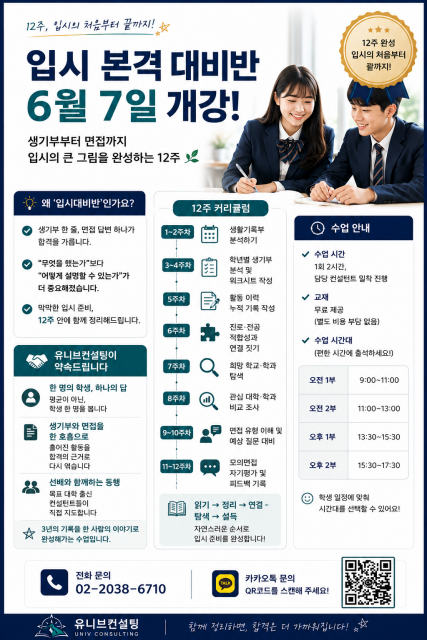

서울 - 입시 컨설팅 기관 유니브컨설팅이 대학 입시를 준비하는 학생을 대상으로 12주 과정의 ‘입시 본격 대비반’을 개설한다.

이 과정은 6월 7일 개강해 8월 30일까지 매주 일요일 진행되며, 생활기록부 분석부터 희망 학과 탐색, 면접 준비까지 입시 준비의 전 과정을 하나의 흐름으로 정리하는 데 초점을 맞췄다.

유니브컨설팅 김류빈 대표원장은 학교생활기록부의 한 줄과 면접 답변 하나가 합격에 영향을 미치는 만큼 무엇을 했는지보다 그것을 어떻게 설명하는지가 중요해졌다는 점을 개설 배경으로 들었다. 또한 막상 준비를 시작하면 생활기록부를 어디서부터 봐야 할지, 학과를 어떻게 좁혀야 할지, 면접을 무엇부터 준비해야 할지 막막한 경우가 많아 이를 12주 안에 체계적으로 정리하도록 돕는 것이 과정의 취지라고 설명했다.

### 12주 커리큘럼, ‘읽기·정리·연결·탐색·설득’ 순으로 구성

12주 과정은 단계별로 짜여 있다. 1\~2주차에는 생활기록부를 분석하고, 3\~4주차에는 학년별 생활기록부를 분석해 워크시트를 작성한다. 5주차에는 활동 이력을 누적 기록하고, 6주차에는 진로·전공 적합성과 활동을 연결짓는다. 7\~8주차에는 희망 학교와 학과를 탐색하고 관심 대학·학과를 비교 조사한다. 9\~10주차에는 면접 유형을 이해하고 예상 질문에 대비하며, 마지막 11\~12주차에는 모의면접을 진행한 뒤 자기평가와 피드백을 기록한다.

유니브컨설팅은 이 과정이 읽기에서 정리, 연결, 탐색, 설득으로 이어지는 입시 준비의 순서를 그대로 따르도록 설계됐다고 설명했다.

### 1회당 2시간 수업, 교재 무료 제공·시간대 선택 가능

수업은 1회당 2시간씩 담당 컨설턴트가 진행하며, 교재는 별도 비용 없이 무료로 제공된다. 수업 시간대는 오전 1부(오전 9\~11시)와 오전 2부(오전 11시\~오후 1시), 오후 1부(오후 1시 30분\~3시 30분)와 오후 2부(오후 3시 30분\~5시 30분)로 나뉜다. 학생은 자신의 일정에 맞춰 시간대를 선택해 출석할 수 있다.

수업이 한 명의 담당 컨설턴트를 중심으로 밀착해 진행되는 방식이어서 학생별 진행 상황과 준비 정도에 맞춰 내용을 조정할 수 있다는 것이 유니브컨설팅의 설명이다. 아울러 이 과정을 수강하는 학생이 최신 트렌드를 반영한 인공지능(AI)·코딩 수업을 함께 신청할 경우 해당 수업은 기존 가격의 절반에 추가 수강할 수 있다.

### 컨설턴트진, ‘학생 한 명에 맞춘 지도’ 강조

유니브컨설팅은 평균이 아닌 학생 한 명을 기준으로 지도하고, 흩어진 활동을 합격의 근거로 다시 엮으며, 목표 대학 출신 컨설턴트가 직접 지도한다는 점을 이 과정의 특징으로 제시했다. 단순히 자료를 채우는 수업이 아니라 3년간의 기록을 한 사람의 이야기로 완성하는 것을 지향한다는 설명이다.

수업을 맡는 컨설턴트인 김류빈 대표원장은 영재학교와 고려대 컴퓨터학과를 거쳐 메가스터디SW입시센터 대표 컨설턴트를 지냈으며, 수시·정시 컨설팅을 담당한다. 나머지 컨설턴트들도 메가스터디SW입시센터 강사 출신으로, 대회·면접·프로젝트, 학생부종합전형, SW·AI 전형 등을 맡는다. 이들은 최근 3년간 카이스트(KAIST), 서울대, 고려대, 연세대, 중앙대 등 주요 대학 진학을 지도해 왔다.

### 6월 7일 개강… 문의는 전화·카카오톡으로

유니브컨설팅은 6월 7일 개강을 앞두고 신청 접수를 받고 있다. 과정에 대한 문의는 전화나 카카오톡 채널을 통해 할 수 있다. 유니브컨설팅 측은 12주 과정이 막상 시작하면 짧게 느껴진다며, 여름이 끝나기 전에 입시의 큰 그림을 잡아두면 가을 이후의 준비 부담을 줄일 수 있다고 말했다.

학생 개개인의 일정과 진로 방향에 맞춰 지도가 이뤄지는 만큼 정원이 제한적이어서 조기에 마감될 수 있다는 것이 유니브컨설팅의 안내다.

### 유니브컨설팅 소개

유니브컨설팅은 ‘한 학생을 위한 1:1 입시 컨설팅’을 제공하는 입시 전문 기관이다. 학생부 관리 로드맵 설계부터 대학·학과별 맞춤 전략, 수시 배치, 면접 대비까지 고입·대입 전 과정을 1:1 맞춤형으로 지원한다. SW·첨단학과 입시에 특화된 전문 컨설턴트진을 보유하고 있으며, 2026학년도 KAIST·고려대 등 다수 대학 합격생을 배출했다.

- 출처: AI경기방송 https://www.kfm.co.kr/news/2026060163527

---

