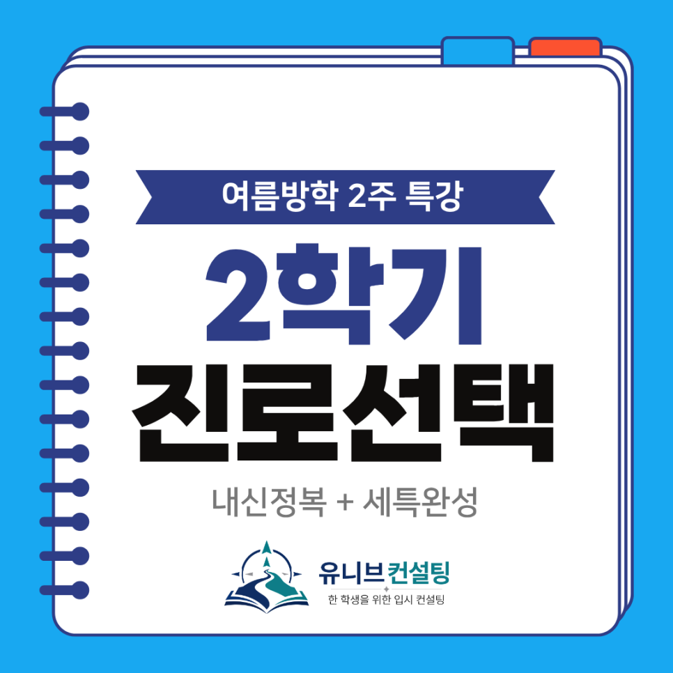
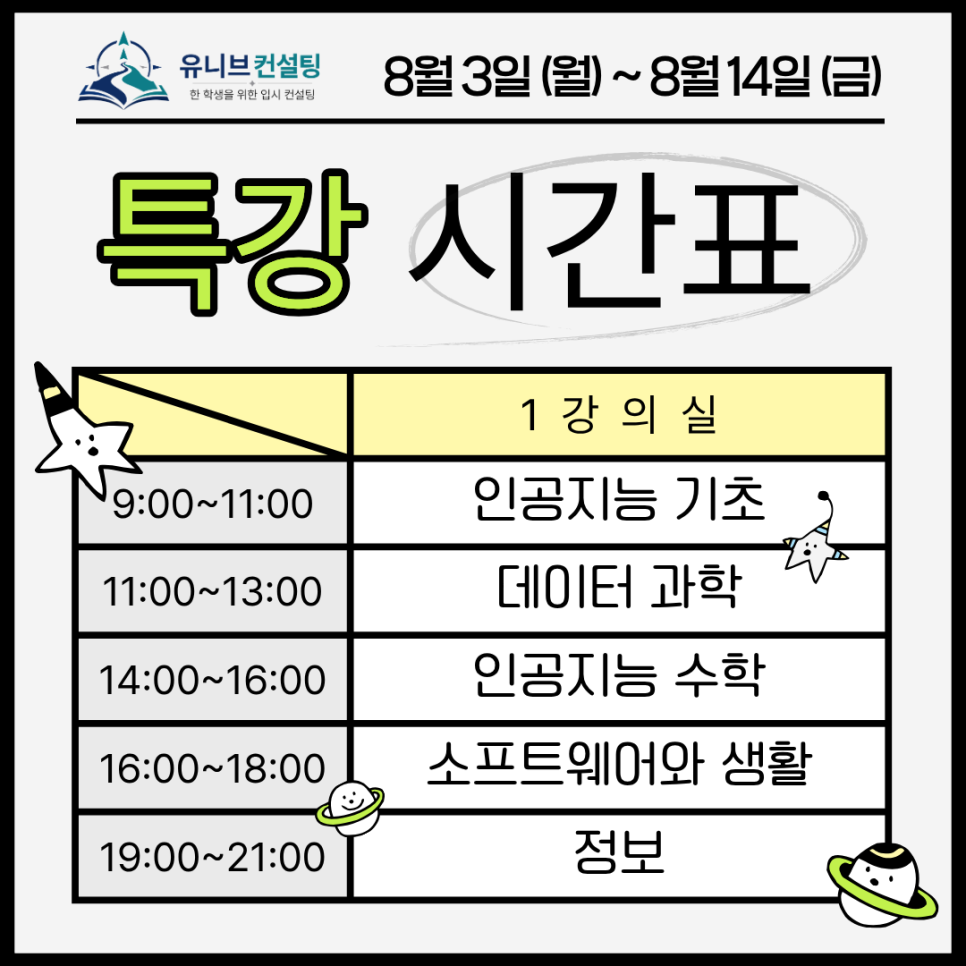
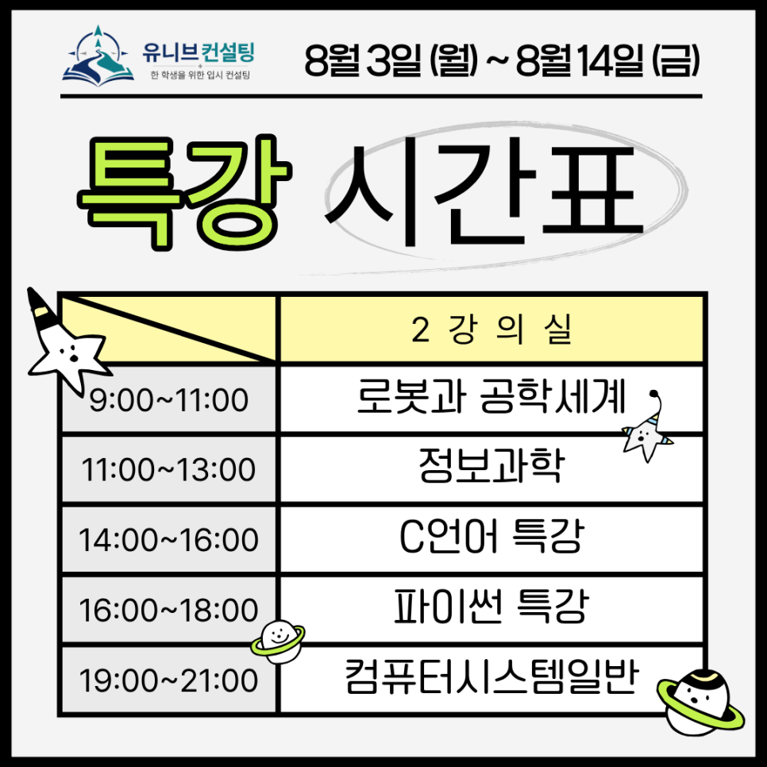

안녕하세요, 유니브컨설팅입니다 👋

2026년 여름방학, 2학기 진로선택과목 내신 대비 특강이 열립니다. 🎉

여름방학은 2학기를 미리 준비할 수 있는 유일한 골든타임이에요.  
방학 2주의 투자가 2학기 내신 등급과 세특의 완성도를 좌우합니다. 🌱

## 🌟 왜 '진로선택과목'이 중요할까요?

고교학점제 시대, 진로선택과목은 단순한 선택이 아니라  
학생의 진로 역량을 보여주는 핵심 평가 요소가 되었어요.
​
내신 5등급제와 2028 대입 개편안 속에서
​
"어떤 과목을 선택했고, 그 과목에서 무엇을 해냈는가"가  
학생부종합전형과 SW·AI 전형의 당락을 가르는 기준이 됩니다.
​
특히 인공지능·정보 계열 과목은 내신 성적 + 세특 기록이 함께 평가되기에  
방학 동안의 선행 대비가 그 어느 과목보다 효과적이에요. 💪

## 📌 방학 특강, 이렇게 운영됩니다
​
✔ 기간 : 8월 3일(월) ~ 8월 14일(금), 2주간
✔ 구성 : 하루 2시간 × 10일 = 총 20시간
✔ 방식 : 온라인/오프라인 동시 진행 (놓친 수업은 녹화본 제공 🎥)
✔ 개강 조건 : 과목당 최소 3명 모집 시 진행
​
✔ 수업 시간 (원하는 시간대 선택)

학원에 못 오는 날에도 온라인 실시간 참여 또는 녹화본으로 빠짐없이 따라갈 수 있어요. 🎯

## 🧩 개설 과목 안내 — 우리 아이 2학기 시간표에 맞춰 선택하세요
​
1️⃣ 강의실 1 — AI·데이터·SW 계열  
인공지능 기초 / 데이터 과학 / 인공지능 수학  
소프트웨어와 생활 / 정보  
👉 AI·데이터 계열 진로선택과목의 개념부터 수행평가 대비까지
​

2️⃣ 강의실 2 — 공학·프로그래밍 계열  
로봇과 공학세계 / 정보과학 / 컴퓨터 시스템 일반  
C언어 특강 / Python 특강  
👉 공학 계열 과목과 프로그래밍 실력을 동시에
​
두 개 강의실에서 동시 진행되어, 시간표에 맞는 과목 조합이 가능합니다. 🌈

## 💡 유니브컨설팅 방학 특강이 특별한 이유
​
✔ 내신 대비를 넘어, 세특 프로젝트 완성까지  
단순히 시험 범위만 공부하는 특강이 아닙니다.  
과목별 세특 프로젝트를 직접 완성하여 2학기 학생부 기록의 재료까지 만들어 드려요.
​

✔ 학생부와 대입을 한 호흡으로  
진로선택과목의 세특 한 줄이 3년 뒤 대입 전형의 핵심 근거가 됩니다.
​

✔ 선배와 함께하는 동행  
목표 대학 출신 컨설턴트들이 직접 지도합니다.
​
단순히 진도를 나가는 게 아니라, 대입 전형까지 내다보고 설계합니다. 💙

## 🎯 특히, 지금이 'SW·AI 전형'의 골든타임입니다

정부의 AI 인재 양성 정책에 따라 주요 대학들이 SW·AI 정원을 빠르게 늘리고 있습니다.
​

진로선택과목의 성취도와 세특은 SW·AI 인재전형에서 가장 먼저 보는 평가 요소예요.
​

같은 생기부, 같은 활동으로 한 단계 위 대학을 노릴 수 있는 가장 현실적인 트랙,

그 시작이 바로 이번 방학 특강입니다. 🚀

## 👨‍🏫 검증된 컨설턴트진이 직접 지도합니다

​
✔ 김류빈 대표원장 — 메가스터디SW입시센터 대표 컨설턴트 출신, 영재학교·고려대 컴퓨터학과, 학생부종합·특기자 컨설팅

✔ 강은솔 컨설턴트 — 메가스터디SW입시센터 대표 강사 출신, 인공지능·게임제작·학생부종합

✔ 심준 컨설턴트 — 메가스터디SW입시센터 대표 강사 출신, 선린인터넷고 정보올림피아드반 강사, 로봇·임베디드·면접

✔ 진은재 컨설턴트 — 영재학교·KAIST 전산학부, 경시대회 출제위원 출신, 특기자·논문 컨설팅

그 외에도 SW·AI 각 분야의 전문 컨설턴트들이 함께합니다.

​최근 3년간 KAIST, 서울대, 고려대, 연세대, 중앙대 등  
주요 대학 진학을 지도해온 탄탄한 실적도 갖추고 있어요. 🏆

## 📅 8월 3일 개강, 지금 신청하세요!
​
과목당 최소 3명 모집 시 개강되며, 시간대별 자리가 빠르게 마감됩니다.  
신청 전 상담을 통해 학생의 2학기 수강 과목에 딱 맞는 특강을 찾아드립니다. 😊  
2학기 내신과 세특, 방학 2주면 충분히 앞서갈 수 있어요.
​

지금이 바로 그 출발점입니다! 🎯
​

📞 전화 문의 : 02-2038-6710  
📩 카카오톡 : https://pf.kakao.com/_xbfEKX/chat

---

